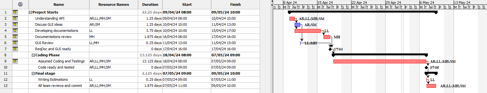

# Project Estimation - CURRENT
Date: 01/05/2024

Version: V1

# Estimation approach
Consider the EZElectronics  project in CURRENT version (as given by the teachers), assume that you are going to develop the project INDEPENDENT of the deadlines of the course, and from scratch
# Estimate by size
### 
|             | Estimate                        |             
| ----------- | ------------------------------- |  
| NC =  Estimated number of classes to be developed   |             6               |             
|  A = Estimated average size per class, in LOC       |                300            | 
| S = Estimated size of project, in LOC (= NC * A) | 1800|
| E = Estimated effort, in person hours (here use productivity 10 LOC per person hour)  |                   180          person hours         |   
| C = Estimated cost, in euro (here use 1 person hour cost = 30 euro) | 5400| 
| Estimated calendar time, in calendar weeks (Assume team of 4 people, 8 hours per day, 5 days per week ) |  1.2 weeks   |               

# Estimate by product decomposition
### 
Estimated efforts for components: code, unit tests, test api, management documents, are assumed because they were not implemented directly by us (team 61).

|         component name    | Estimated effort (person hours)   |             
| ----------- | ------------------------------- | 
|requirement document    | 20 | 
| GUI prototype |15|
|design document |-|
|code |60|
| unit tests |55|
| api tests |20|
| management documents  |20|

# Estimate by activity decomposition
### 

In the following Gantt chart, day 9/April is considered as the starting day of work and the end of work is scaled accordingly the timeSheet.md duration and considering days of 8 working hours (9:00 am to 5:00 pm), 5 days per week

|         Activity name    | Estimated effort (person hours)   |             
| ----------- | ------------------------------- | 
|Understanding API| 10 |
|Discuss GUI ideas |10|
|Developing documentations| 30|
|Documentations review|15|
|GUI Review|2|
|Assumed Coding and Testings | 105 |
|Writing Estimations |2|
|All team reviews and commit|15|
###

# Summary
All three estimation methods result are similar but slightly higher values for the product decomposition and activity decomposition as we would be expected because the focus of each estimation are different (by size: measure only the size of the final product, by decomposition: breakdown the project into components and for this reason is more detailed, by activity decomposition: breakdown the project into actiities). The estimated duration is based on a 4-member team sharing the work hours equally.

|             | Estimated effort                        |   Estimated duration |          
| ----------- | --------------------------------------- | -------------------- |
| estimate by size |180 person hours| 1.2 week|
| estimate by product decomposition |190 person hours| 1.4 weeks|
| estimate by activity decomposition |189 person hours| 1.4 week |

