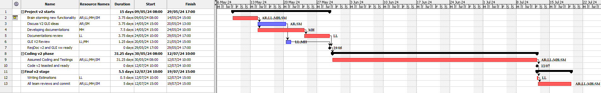

# Project Estimation - FUTURE
Date: 02/05/2024

Version: V2

# Estimation approach
Consider the EZElectronics  project in FUTURE version (as proposed by your team in requirements V2), assume that you are going to develop the project INDEPENDENT of the deadlines of the course, and from scratch (not from V1)
# Estimate by size
### 
|             | Estimate                        |             
| ----------- | ------------------------------- |  
| NC =  Estimated number of classes to be developed   |       15                      |             
|  A = Estimated average size per class, in LOC       |          300               | 
| S = Estimated size of project, in LOC (= NC * A) | 4500 |
| E = Estimated effort, in person hours (here use productivity 10 LOC per person hour)  |    450                                 |   
| C = Estimated cost, in euro (here use 1 person hour cost = 30 euro) | 13500 | 
| Estimated calendar time, in calendar weeks (Assume team of 4 people, 8 hours per day, 5 days per week ) |           3 weeks         |               

# Estimate by product decomposition
### 
|         component name    | Estimated effort (person hours)   |             
| ----------- | ------------------------------- | 
|requirement document    | 45 |
| GUI prototype |30|
|design document |-|
|code |150|
| unit tests |130|
| api tests |60|
| management documents  |40|

# Estimate by activity decomposition

The start of Project v2 is assumed to occur on May 9, coinciding with the conclusion of v1 development.
### 
|         Activity name    | Estimated effort (person hours)   |             
| ----------- | ------------------------------- | 
| Brain storming new functionality| 30 |
|Discuss V2 GUI ideas |30|
|Developing documentations| 60|
|Documentations review|30|
|GUI V2 Review|10|
|Assumed Coding and Testings | 250 |
|Writing Estimations |4|
|All team reviews and commit|40|
###

# Summary

All three estimation methods result are similar but slightly higher values for the product decomposition and activity decomposition as we would be expected because the focus of each estimation are different (by size: measure only the size of the final product, by decomposition: breakdown the project into components and for this reason is more detailed, by activity decomposition: breakdown the project into actiities). The estimated duration is based on a 4-member team sharing the work hours equally.

|             | Estimated effort                        |   Estimated duration |          
| ----------- | ------------------------------- | ---------------|
| estimate by size |450 |3 weeks|
| estimate by product decomposition |455| 3.04 weeks |
| estimate by activity decomposition |454| 3.03 weeks|

