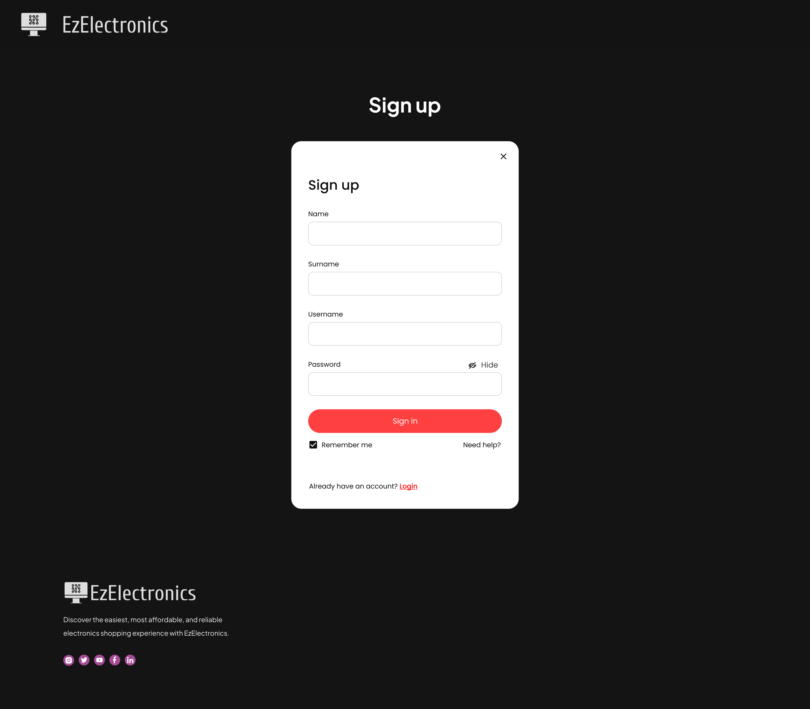
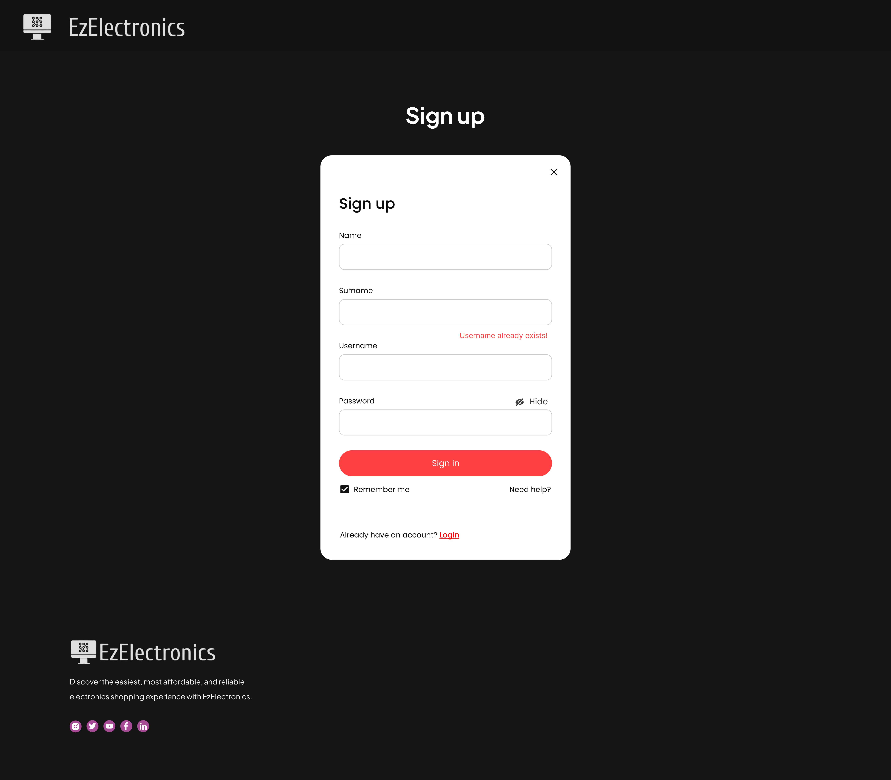
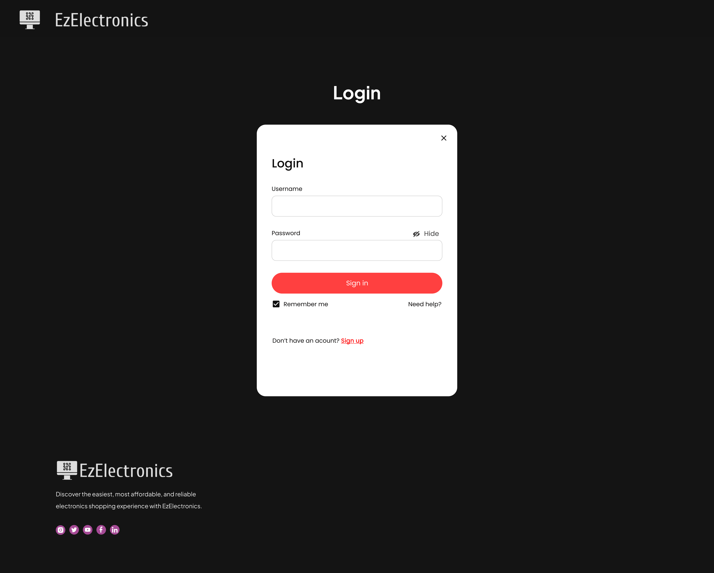
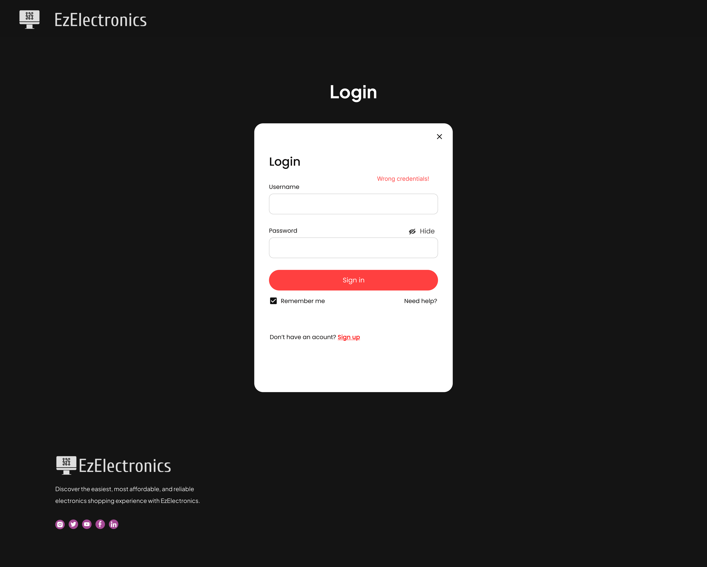
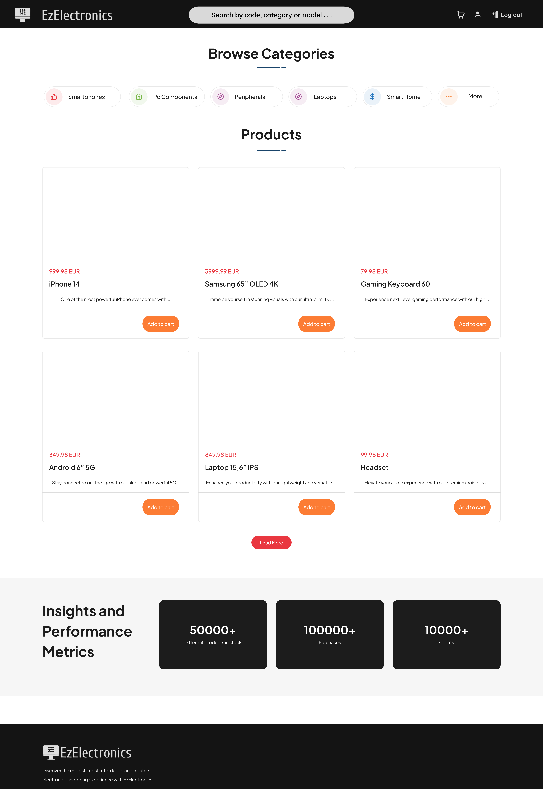
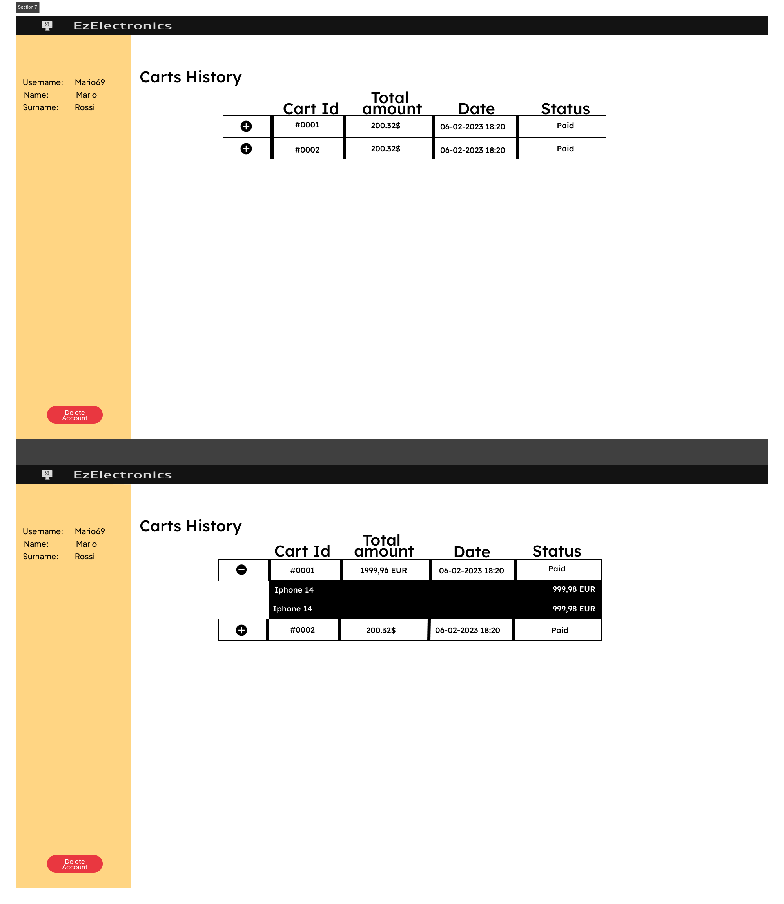
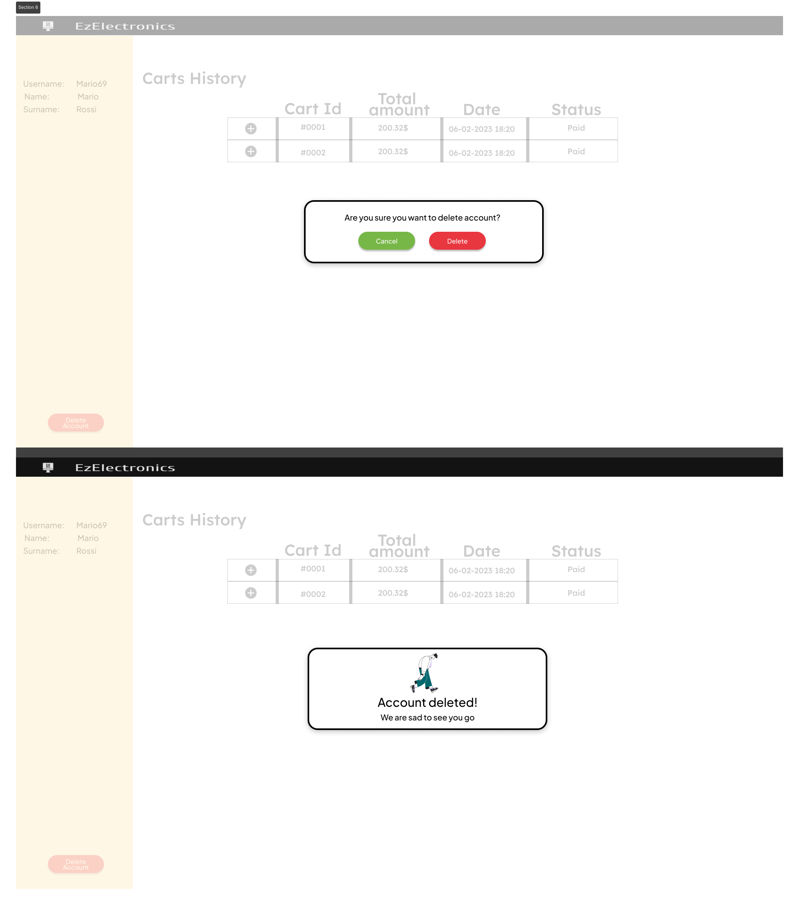
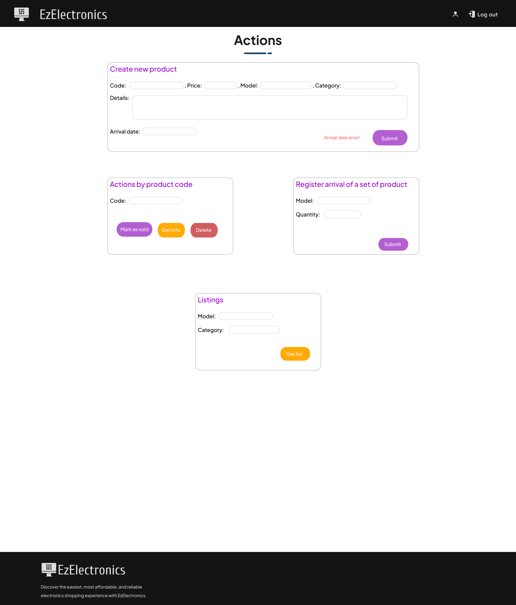
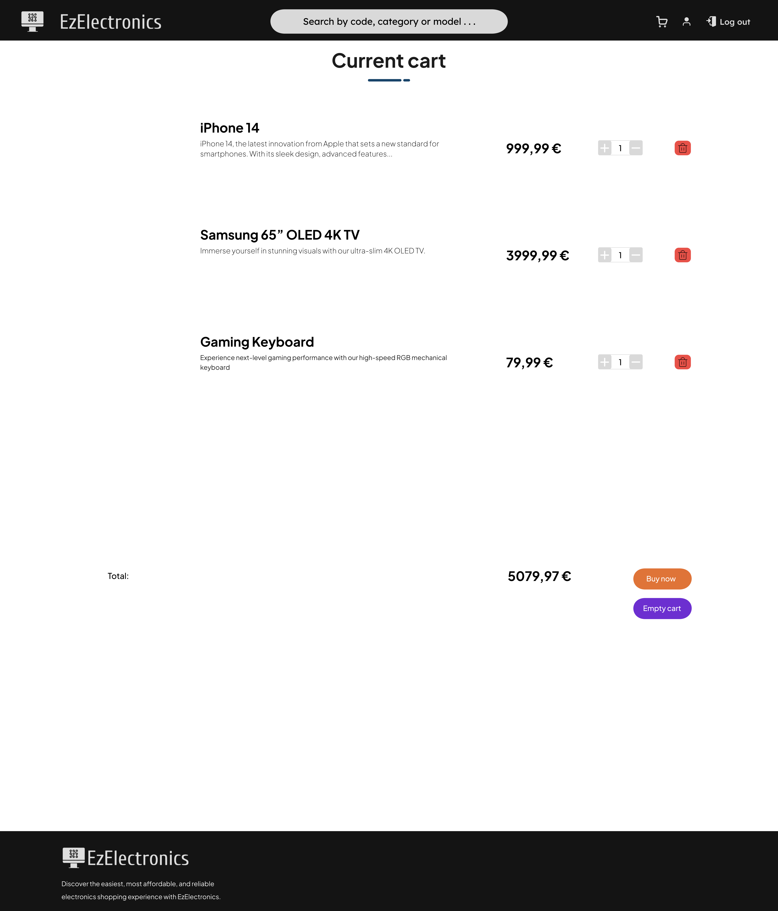

# Graphical User Interface Prototype - CURRENT

Authors: Group 61

Date: 01-05-2024

Version: 1.0

| Version | Changes | 
| ----------------- |:-----------|
| 1.0 | Added GUI Images |

## Use Case 1.0: Access Management (Sign up)

Whether the user inputs a username already existing an error message is displayed.

Then, he/she is logged in and is able to see the homepage.

## Use Case 1.1: Access Management (Login)

Whether the user inputs wrong credential an error message is displayed.

When the user correctly inserts the username and password, he/she is logged in and is able to see the homepage (customer in this example).

## Use Case 2: Account Management
When a registered user enters this page they can, see the history of past carts or delete their account.
 
In case of deletion, the confirmation message comes out

## Use Case 3: Product Management
A user who has manager privileges can manage products:
* register the arrival of a set of products, get listings by model, category or even the whole dataset of products, create a new product

possibly generating an error message associated with the arrival date inserted or an "already existing product" error message

* get info/delete/mark as sold about a specific product, possibly generating two distinct error massages

## Use Case 4: Cart Management
Customer can visualize his current cart and the products associated. He's able to edit the quantities of the products inside the cart and proceed to buy.

