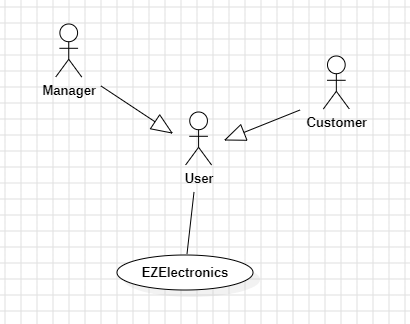
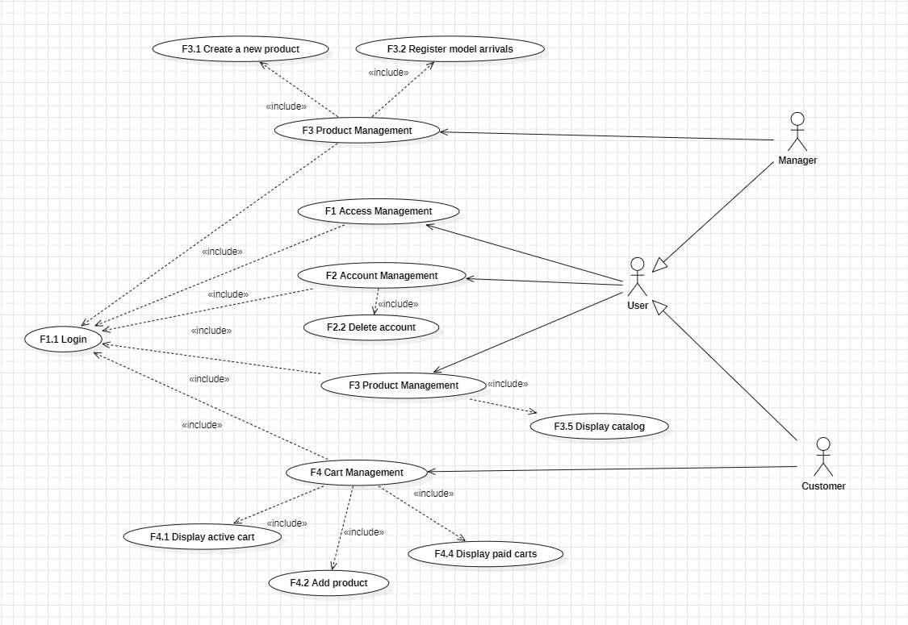
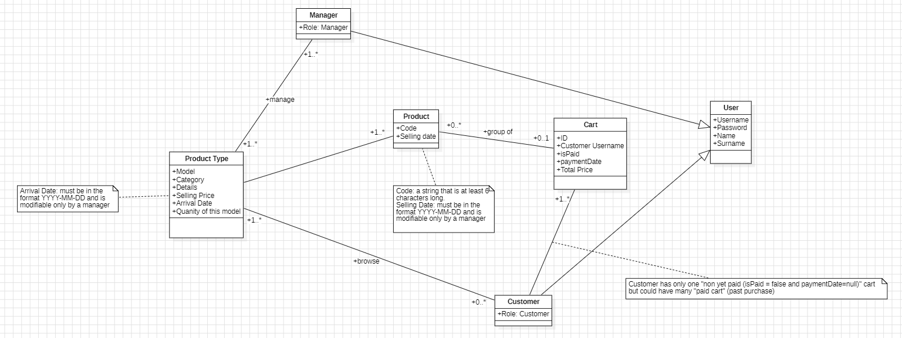
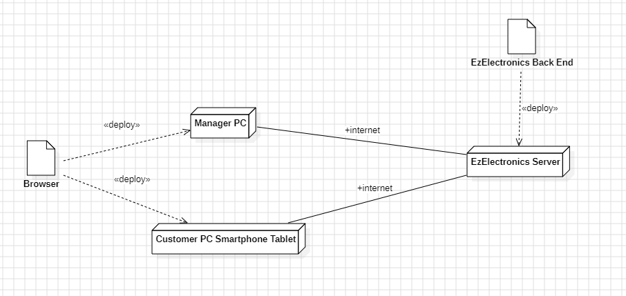

# Requirements Document - current EZElectronics

Date: 

Version: V1 - description of EZElectronics in CURRENT form (as received by teachers) 

| Version number | Change |
| :------------: | :----: |
|                |        |

# Contents

- [Requirements Document - current EZElectronics](#requirements-document---future-ezelectronics)
- [Contents](#contents)
- [Informal description](#informal-description)
- [Stakeholders](#stakeholders)
- [Context Diagram and interfaces](#context-diagram-and-interfaces)
  - [Context Diagram](#context-diagram)
  - [Interfaces](#interfaces)
- [Stories and personas](#stories-and-personas)
- [Functional and non functional requirements](#functional-and-non-functional-requirements)
  - [Functional Requirements](#functional-requirements)
  - [Non Functional Requirements](#non-functional-requirements)
- [Use case diagram and use cases](#use-case-diagram-and-use-cases)
  - [Use case diagram](#use-case-diagram)
    - [Use case 1, Access Management](#use-case-1-access-management)
      - [Scenario 1.1: Login](#scenario-11-login)
      - [Scenario 1.2: Logout](#scenario-12-logout)
      - [Exception 1.1: Technical difficulties](#exceptions-11-technical-difficulties)
    - [Use case 2, Account Manager](#use-case-2-account-manager)
      - [Scenario 2.1: Delete account](#scenario-21-delete-account) 
    - [Use case 3, Product Management](#use-case-3-product-management)
      - [Scenario 3.1: Create new product](#scenario-31-create-new-product)
      - [Scenario 3.2: Register products arrivals](#scenario-32-register-products-arrivals)
      - [Scenario 3.3: Display catalog](#scenario-33-display-catalog)
      - [Scenario 3.4: Extract product informations](#scenario-34-extract-product-informations)
    - [Use case 4, Cart Management](#use-case-4-cart-management)
      - [Scenario 4.1: Display user cart](#scenario-41-display-user-cart)
      - [Scenario 4.2: Add product to user cart](#scenario-42-add-product-to-user-cart)
      - [Scenario 4.3: Display users paid cart](#scenario-43-display-users-paid-cart)
- [Glossary](#glossary)
- [System Design](#system-design)
- [Deployment Diagram](#deployment-diagram)

# Informal description

EZElectronics (read EaSy Electronics) is a software application designed to help managers of electronics stores to manage their products and offer them to customers through a dedicated website. Managers can assess the available products, record new ones, and confirm purchases. Customers can see available products, add them to a cart and see the history of their past purchases.

# Stakeholders

| Stakeholder name |          Description           |
| :--------------: | :----------------------------: |
|     Manager      | Manages inventory and products |
|     Customer     |          Buy products          |

# Context Diagram and interfaces

## Context Diagram

## Interfaces

| Actor    | Logical Interface | Physical Interface   |
| -------- | ----------------- | -------------------- |
| Manager  | GUI               | PC                   |
| Customer | GUI               | PC/Smartphone/Tablet |

# Stories and personas

## Customer Persona:
### Name: Emily
### Story: 
    Emily, a 53-year-old tech enthusiast and dedicated homemaker, is the backbone of her family's technological needs. With a household full of gadgets and devices, she takes pride in sourcing the latest and greatest tech products to keep her family connected and entertained. Emily loves the thrill of discovering new deals and promotions online, often spending hours browsing through Ezelectronics' extensive product catalog.
    However, Emily's patience wears thin if she encounters any obstacles, such as slow-loading pages or payment errors. Emily expects a seamless and efficient shopping experience, allowing her to quickly complete her transactions and get back to managing her busy household.
    Her indecision often leads to her removing and adding items to her cart multiple times as she weighs her options and considers different products. Emily values a website that can keep up with her changing preferences and allows her to easily adjust her selections without any hassle.

## Manager Persona:
### Name: David
### Story:
    David, a 45-year-old manager at Ezelectronics, with a background in business management and a dedication to his role.
    His days are filled with a range of responsibilities, including creating new products, registering the arrival of product shipments, marking products as sold, and managing the product catalog such as deleting products when necessary and update the catalog.
    Recognizing the importance of providing customers with access to a comprehensive product range, David ensures that his complete products catalog is regularly updated and organized. 

# Functional and non functional requirements

## Functional Requirements

| ID  | Type               | Description                                                                                                                                                                                                                                                                                                                                                                                         |
| :-: | ------------------ | :-------------------------------------------------------------------------------------------------------------------------------------------------------------------------------------------------------------------------------------------------------------------------------------------------------------------------------------------------------------------------------------------------- |
| FR1 | Access Management  | F1.1: Login F1.2: Load data for the active user F1.3: Logout                                                                                                                                                                                                                                                                                                                                  |
| FR2 | Account Management | F2.1: Create a new user F2.2: Delete account by username                                                                                                                                                                                                                                                                                                                                         |
| FR3 | Product Management | F3.1: Create a new product F3.2: Register the arrival of a set of products of the same model F3.3: Marks products as sold F3.4: Delete a product F3.5: Display the complete product catalog F3.6: Extract product information from code F3.7: Display the products catalog from a category F3.8: Display the complete catalog from a model                                     |
| FR4 | Cart Management    | F4.1: Display the contents of the current user's cart F4.2: Add the product to the logged-in user's cart F4.3: On successful payment, mark current cart as purchased (payment date: today) F4.4: Display a list of all the customer's paid carts except for the active one F4.5: Delete an item from the current logged-in user's cart F4.6: Empty the current logged-in user's cart |

## Non Functional Requirements

|  ID  |        Type         | Description                                                                                                                                                                                                                                                                                                                                                                                                                | Refers to |
| :--: | :-----------------: | :------------------------------------------------------------------------------------------------------------------------------------------------------------------------------------------------------------------------------------------------------------------------------------------------------------------------------------------------------------------------------------------------------------------------- | :-------: |
| NFR1 |    **Usability**    | - The user interface should be intuitive and easy to navigate, ensuring a seamless shopping experience for customers: **Users should be able to use app with no train in less than 10 minutes after registration and login**                                                                                                                                                                                               |  All FR   |
| NFR2 |   **Efficiency**    | - The system should be able to handle simultaneous transactions efficiently, even during peak times, without significant degradation in performance: **All non-database interactions must achieve sub 0.1 seconds response times. Database interactions should be completed within 5 seconds**                                                                                                                             |  All FR   |
| NFR3 |   **Reliability**   | - The platform should be available and accessible to users consistently with a **target uptime exceeding 99.99% for user interactions** and strive for minimal service disruption, aiming for **less than one minute of downtime per year per user** (0.01% time frame) . - Data integrity should be maintained throughout the system, ensuring that orders, payments, and user information remain accurate and secure. |  All FR   |
| NFR4 | **Maintainability** | - The codebase should be well-structured and documented, facilitating easier maintenance and future enhancements by development teams. - Updates and patches should be deployed smoothly without disrupting the normal operation of the platform, ensuring continuous improvement and security.                                                                                                                         |  All FR   |
| NFR5 |   **Portability**   | - The system should be designed to be compatible with a large variety of devices and operating systems, allowing users to access the platform seamlessly from desktops, laptops, tablets, and smartphones: 1. Chrome from version 121 2. Safari 17 3. Firefox 122 4. Edge 123                                                                                                                                  |  All FR   |
| NFR6 |    **Security**     | - Access controls should be implemented to prevent unauthorized users from accessing or modifying data. - Regular security audits and updates should be conducted to identify and address potential vulnerabilities, ensuring that customer data remains protected from security threats.                                                                                                                               |  All FR   |
# Use case diagram and use cases

## Use case diagram

### Use case 1, Access Management
**Informal description**: User wants to access the functionalities of their own account

| Actors Involved  |                                            User                                             |
| :--------------: | :-----------------------------------------------------------------------------------------: |
|   Precondition   |                                     User has an account                                     |
|  Post condition  |                                User access to their account                                 |
| Nominal Scenario |                                 S1.1: Login S1.2: Logout                                 |
|     Variants     | V1.1:User loses account access right due to violations to End User License Agreement (EULA)|
|    Exceptions    |    E1.1:The system is experiencing technical difficulties and cannot process  requests.  E1.2: The user inserted wrong credentials     |

### Scenario 1.1: Login
- **Pre-conditions:** User is not logged in, User has already an account.
- **Post-conditions:** User is logged in and has access to functionalities based on their role

| **Step#** | Description                                                                                                         |
| --------- | ------------------------------------------------------------------------------------------------------------------- |
| 1         | The user enters a valid username and password                                                                       |
| 2         | The system validates the credentials against the user database                                                      |
| 3         | Success: The system logs the user in, displays a success message, and presents functionalities based on their role. |

### Scenario 1.2: Logout
- **Pre-conditions:** User is logged in, User has already an account.
- **Post-conditions:** User session is terminated, and the user is redirected to the login page 

| **Step#** | Description                                                                          |
| --------- | ------------------------------------------------------------------------------------ |
| 1         | The user initiates a logout request                                                  |
| 2         | The system terminates the user session                                               |
| 3         | The system displays a confirmation message and redirects the user to the login page. |

### Exceptions 1.1: Technical difficulties
- **Pre-conditions:** User is logged in, User has already an account.
- **Post-conditions:** Error message displayed 

| **Step#** | Description                                                |
| --------- | ---------------------------------------------------------- |
| 1         | The user initiates a request                               |
| 2         | The system try to start the itinerary based on the request |
| 3         | The system goes in timeout.                                |
| 4         | The system display error message based on the request      |

### Use case 2, Account Manager
**Informal description**: User wants to manage their own account

| Actors Involved  |                                              User                                              |
| :--------------: | :--------------------------------------------------------------------------------------------: |
|   Precondition   |                            User has an account User is logged in                            |
|  Post condition  |                                   User managed their account                                   |
| Nominal Scenario |                                      S2.1: Delete account                                      |
|     Variants     | V2.1:To complete the management processes, the system might need customer service verification |
|    Exceptions    |      E1.1:The system is experiencing technical difficulties and cannot process  requests.      |

### Scenario 2.1: Delete account
- **Pre-conditions:** User is logged in
- **Post-conditions:** User's account deleted

| **Step#** | Description                                                 |
| --------- | ----------------------------------------------------------- |
| 1         | The user does the login                                     |
| 2         | The user request to delete his account (e.g. from a button) |
| 3         | The system ask for confirmation for deletion                |
| 4         | The user confirms the desire to delete the account          |
| 5         | The system delete user data based on the username           |
| 6         | The system displays the confirmation message                |

### Use case 3, Product Management
**Informal description**: User wants to manage product depending on their role.

| Actors Involved  |                                                                                             User                                                                                             |
| :--------------: | :------------------------------------------------------------------------------------------------------------------------------------------------------------------------------------------: |
|   Precondition   |                                                                           User has an account User is logged in                                                                           |
|  Post condition  |                                                                    User had done products management based on their role                                                                     |
| Nominal Scenario | S3.1: Create a new product S3.2: Register the arrival of a set of products of the same model S3.3: Display the complete product catalog S3.4: Extract product information from code |
|     Variants     |                            V3.1: The system can automatically remove products from the catalog according to the current updated regulations of the country of use                            |
|    Exceptions    |                                                     E1.1:The system is experiencing technical difficulties and cannot process  requests.                                                     |

### Scenario 3.1: Create new product
- **Pre-conditions:** User, with Manager role, is logged in
- **Post-conditions:** A new product entry is created in the database

| **Step#** | Description                                                                                                                         |
| --------- | ----------------------------------------------------------------------------------------------------------------------------------- |
| 1         | The Manager is logged in.                                                                                                           |
| 2         | The Manager provides new product details (name, description, category, model, price, etc.)                                          |
| 3         | The system validates the information (e.g., unique product identifier, missing required fields, correct format of the informations) |
| 4         | The system creates a new product entry in the database with the provided details                                                    |
| 5         | The system displays the confirmation message                                                                                        |

### Scenario 3.2: Register products arrivals
- **Pre-conditions:** User, with Manager role, is logged in
- **Post-conditions:** The stock quantity for the specified product model is increased

| **Step#** | Description                                                                 |
| --------- | --------------------------------------------------------------------------- |
| 1         | The Manager is logged in                                                    |
| 2         | The Manager selects a product model from the system                         |
| 3         | The Manager specifies the quantity and the date of new products arriving    |
| 4         | The system validates the information (e.g., positive quantity)              |
| 5         | The system updates the stock quantity for the product model in the database |
| 6         | The system displays the confirmation message                                |

### Scenario 3.3: Display catalog
- **Pre-conditions:** User is logged in
- **Post-conditions:** System display a list of all products in the catalog on the user interface

| **Step#** | Description                                                       |
| --------- | ----------------------------------------------------------------- |
| 1         | The User is logged in                                             |
| 2         | The User requests a list of all products                          |
| 3         | The system retrieves a list of all the products from the database |
| 4         | The system returns the list  to the User interface                |

### Scenario 3.4: Extract product informations
- **Pre-conditions:** User is logged in, product code is valid.
- **Post-conditions:** User receives information about the specified product

| **Step#** | Description                                                                  |
| --------- | ---------------------------------------------------------------------------- |
| 1         | The user is logged in                                                        |
| 2         | The user enters a valid product code                                         |
| 3         | The system retrieves product data associated with the code from the database |
| 4         | The system returns the product information to the user interface             |

### Use case 4, Cart Management
**Informal description**: Customer wants to manage their own shopping cart.

| Actors Involved  |                                                                                             User                                                                                             |
| :--------------: | :------------------------------------------------------------------------------------------------------------------------------------------------------------------------------------------: |
|   Precondition   |                                                                           User has an account User is logged in                                                                           |
|  Post condition  |                                                                                User had done cart management                                                                                 |
| Nominal Scenario | S4.1: Display the contents of the current user's cart S4.2: Add a product to the logged-in user's cart S4.3: Display a list of all the customer's paid carts except for the active one |
|     Variants     |                                               V4.1: The system clear the user shopping cart after a certain number of days from the last login                                               |
|    Exceptions    |                                                     E1.1:The system is experiencing technical difficulties and cannot process  requests.                                                     |
### Scenario 4.1: Display user cart
- **Pre-conditions:** User, with Customer role, is logged in.
- **Post-conditions:** The customer receives a list of products in their cart

| **Step#** | Description                                                                                                     |
| --------- | --------------------------------------------------------------------------------------------------------------- |
| 1         | The customer is logged in                                                                                       |
| 2         | The customer requests to view their cart (e.g. pressing the cart button).                                       |
| 3         | The system retrieves product information for all items in the customer's cart.                                  |
| 4         | The system returns a list of products with main details (e.g., name, quantity, price) to the customer interface |

### Scenario 4.2: Add product to user cart
- **Pre-conditions:** User, with Customer role, is logged in, product exists in the system.
- **Post-conditions:** The chosen product is added to the customer's cart.

| **Step#** | Description                                                         |
| --------- | ------------------------------------------------------------------- |
| 1         | The customer is logged in                                           |
| 2         | The customer selects a product from the system                      |
| 3         | The customer chooses the quantity to add to the cart                |
| 4         | The system validates the request (e.g., sufficient stock available) |
| 5         | The system adds the product and quantity to the Customer's cart     |
| 6         | The system returns a success message                                |

### Scenario 4.3: Display users paid cart
- **Pre-conditions:** User, with Customer role, is logged in.
- **Post-conditions:** The customer receives a list, if any, of their past purchases (excluding the current cart)

| **Step#** | Description                                                                                                    |
| --------- | -------------------------------------------------------------------------------------------------------------- |
| 1         | The customer is logged in                                                                                      |
| 2         | The customer requests a list of their past purchases (e.g. pressing a dedicated button for "Purchase History") |
| 3         | The system retrieves a list, if any, of the customer's shopping carts marked as paid (payment data not null)   |
| 4         | The system returns a list of past purchases to the Customer interface                                          |

# Glossary

# System design

Not meaningful in this case.
# Deployment Diagram

