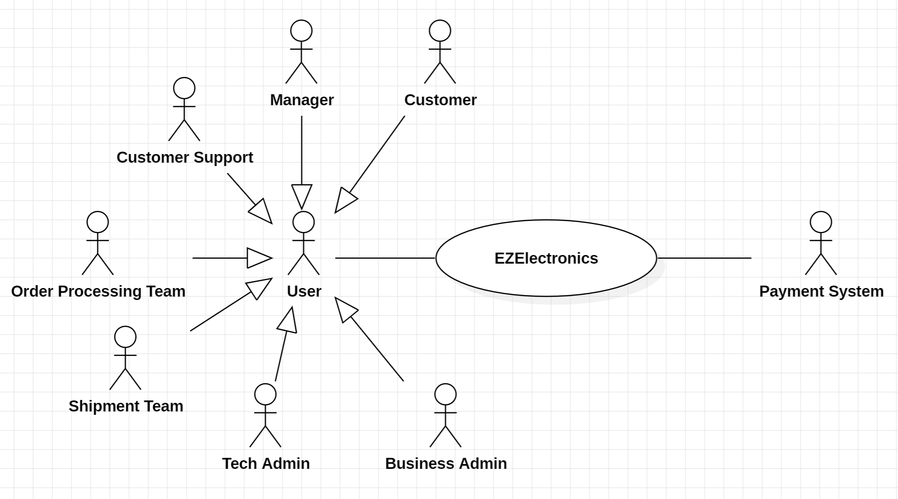
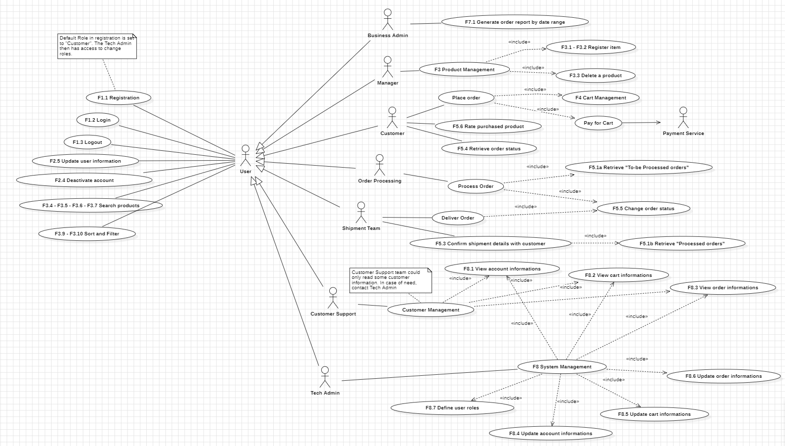
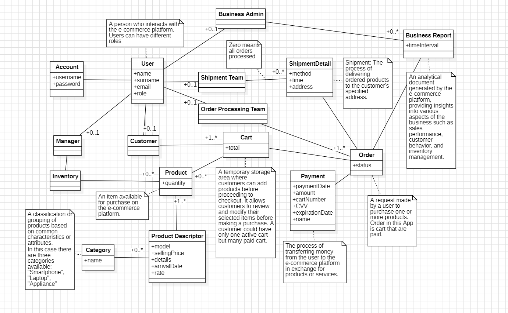
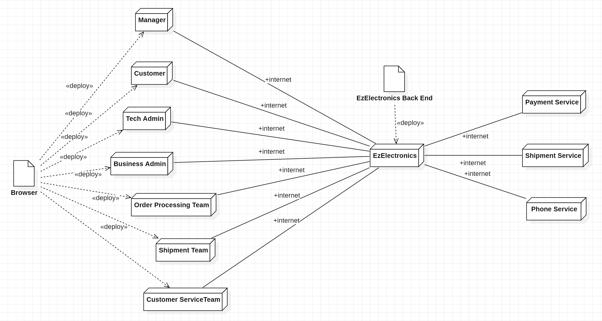

# Requirements Document - future EZElectronics

Date: May / 2024

Version: V2 - EZElectronics Future Overview

The proposed version V2 of EZElectronics represents a significant evolution of e-commerce platform, aimed at enhancing the user experience, improving system efficiency, and expanding business capabilities. In this version, we plan to introduce several new features and enhancements to meet the growing demands of customers and stakeholders.

Key highlights of EZElectronics V2 include:

|Version number|Change|Description|Value Added|
|---|---|---|---|
|V2|**Real-time Update on Quantities**|Enable real-time updates on product quantities to reflect changes instantly when products are added to or removed from the cart.|This feature enhances the user experience by ensuring that product quantities are updated in real-time, which complements the existing functionality related to managing product inventory.|
|V2|**Payment System**|Integrate a secure payment gateway to facilitate online payments for purchases made on the platform.|Introducing a payment system adds a crucial aspect to the platform, allowing users to make purchases online, which is a fundamental feature for an e-commerce application.|
|V2|**Order Processing Team**|Coordinate the processing of orders, including organizing, packing, and preparing them for delivery to the shipment team after successful payment.|The Order Processing Team plays a crucial role in ensuring that orders are processed efficiently and accurately, contributing to the smooth operation of the platform's order fulfillment process and enhancing customer satisfaction.|
|V2|**Shipment Team**|Shipment team contacts user via email after successful payment to set a time and method for order.|Enhances customer satisfaction and complements purchase function.|
|V2|**Access Constraints**|Implement access constraints to restrict certain functionalities to authorized personnel only, enhancing platform security.|Adding access constraints enhances security and control over the platform, ensuring that only authorized personnel can perform certain critical actions, such as deleting accounts.|
|V2|**Role-based Access Control**|Introduce role-based access control, distinguishing between tech admins and business admins, each with specific capabilities and permissions tailored to their roles.|Introducing role-based access control allows for more granular control over user permissions, distinguishing between tech admins and business admins, which adds flexibility and security to the platform's user management system.|
|V2|**Sort and Filter Options**|Enhance user experience by adding sorting and filtering options to the product catalog, enabling customers to find products more efficiently based on various criteria.|Enhancing the product catalog with sort and filter options improves the user experience, enabling customers to find products more efficiently, which complements the existing functionalities related to browsing and searching for products.|
|V2|**Customer Service**|Integrate customer service functionality to assist users with account-related issues and provide support throughout the shopping experience.|Integrating customer service functionality is essential for providing support to users throughout their shopping experience, addressing any queries or issues they may encounter, which enhances customer satisfaction and complements the existing functionalities related to user interaction and support.|
|V2|**Product Rating**|Allow users to rate purchased products using a star rating system (1 star to 5 stars).|Implementing a star rating system allows users to easily convey their opinions , helping other customers make informed purchasing decisions and fostering a sense of community within the platform.|

# Contents

- [Requirements Document - future EZElectronics](#requirements-document---future-ezelectronics)
- [Contents](#contents)
- [Informal description](#informal-description)
- [Stakeholders](#stakeholders)
- [Context Diagram and interfaces](#context-diagram-and-interfaces)
  - [Context Diagram](#context-diagram)
  - [Interfaces](#interfaces)
- [Stories and personas](#stories-and-personas)
- [Functional and non functional requirements](#functional-and-non-functional-requirements)
  - [Functional Requirements](#functional-requirements)
  - [Non Functional Requirements](#non-functional-requirements)
- [Use case diagram and use cases](#use-case-diagram-and-use-cases)
  - [Use case diagram](#use-case-diagram)
    - [Use case 1, Authenticate](#use-case-1-authenticate)
      - [Scenario 1.1: Login](#scenario-11-login)
      - [Exception 1.1: Incorrect credentials](#exception-11-incorrect-credentials)
    - [Use case 2, Register](#use-case-2-register)
      - [Scenario 2.1: Signup](#scenario-21-signup)
      - [Exception 2.1:  Constraints not respected](#exception-21-constraints-not-respected)
    - [Use case 3, Define Role](#use-case-3-define-role)
      - [Scenario 3.1: Tech admin defines role for a user by username](#scenario-31-tech-admin-defines-role-for-a-user-by-username)
      - [Exception 3.1: Incorrect changes](#exception-31-incorrect-changes)
    - [Use case 4, Logout management](#use-case-4-logout-management)
      - [Scenario 4.1: Logout](#scenario-41-logout)
    - [Use case 5, Delete Account](#use-case-5-delete-account)
      - [Scenario 5.1: Requesting account deletion](#scenario-51-requesting-account-deletion)
      - [Variants 5.1: The tech admin removes user accounts](#variant-51-the-tech-admin-removes-user-accounts)
    - [Use Case 6: Update Account Information](#use-case-6-update-account-information)
      - [Scenario 6.1: The user edits their account details](#scenario-61-the-user-edits-their-account-details)
    - [Use case 7, Place Order](#use-case-7-place-order)
      - [Scenario 7.1: Manage Cart and Pay for Cart](#scenario-71-manage-cart-and-pay-for-cart)
    - [Use case 8, Payment](#use-case-8-payment)
      - [Scenario 8.1: Complete Payment](#scenario-81-complete-payment)
      - [Exception 8.1: Payment Failure](#exception-81-payment-failure)
    - [Use Case 9: Manage Cart](#use-case-9-manage-cart)
      - [Scenario 9.1: Add Product to Cart](#scenario-91-add-product-to-cart)
      - [Scenario 9.2: Remove Product from Cart](#scenario-92-remove-product-from-cart)
      - [Scenario 9.3: Empty Cart](#scenario-93-empty-cart)
    - [Use Case 10: Manage Inventory](#use-case-10-manage-inventory)
      - [Scenario 10.1: Register New Product](#scenario-101-register-new-product)
      - [Scenario 10.2: Register Arrival of Products](#scenario-102-register-arrival-of-products)
      - [Scenario 10.3: Remove Product](#scenario-103-remove-product)
    - [Use Case 11: Search Items](#use-case-11-search-items)
      - [Scenario 11.1: View All Products](#scenario-111-view-all-products)
      - [Scenario 11.2: View Product by Code](#scenario-112-view-product-by-code)
      - [Scenario 11.3: View Products by Category](#scenario-113-view-products-by-category)
      - [Scenario 11.4: View Product by Model](#scenario-114-view-products-by-model)
      - [Scenario 11.5: Sort and Filter Items](#scenario-115-sort-and-filter-items)
    - [Use Case 12: Process Order](#use-case-12-process-order)
      - [Scenario 12.1: Changes order status](#scenario-121-changes-order-status)
    - [Use Case 13: Shipment management ](#use-case-13-shipment-management)
      - [Scenario 13.1: Retrieve shipping details](#scenario-131-retrieve-shipping-details)
    - [Use Case 14: Delivery management](#use-case-14-delivery-management)
      - [Scenario 14.1: Successful delivery](#scenario-141-successful-delivery)
      - [Exception 14.2: Unsuccessful delivery](#exception-142-unsuccessful-delivery)
    - [Use Case 15: Check Order Details](#use-case-15-check-order-details)
      - [Scenario 15.1: Retrieve order status](#scenario-151-retrieve-order-status)
    - [Use Case 16: Access and Modify Database Information](#use-case-16-access-and-modify-database-information)
      - [Scenario 16.1: Retrieve account information](#scenario-161-retrieve-account-information)
      - [Scenario 16.2: Retrieve cart information](#scenario-162-retrieve-cart-information)
      - [Scenario 16.3: Retrieve order information](#scenario-163-retrieve-order-information)
      - [Scenario 16.4: Update account information](#scenario-164-update-account-information)
      - [Scenario 16.5: Update cart information](#scenario-165-update-cart-information)
      - [Scenario 16.6: Update order information](#scenario-166-update-order-information)
    - [Use Case 17: Retrieve Business Reports](#use-case-17-retrieve-business-reports)
      - [Scenario 17.1: Retrieve Purchase Amount](#scenario-171-retrieve-purchase-amount)
      - [Scenario 17.2: Retrieve top selling product category](#scenario-172-retrieve-top-selling-product-category)
    - [Use Case 18: Ratings](#use-case-18-ratings)
      - [Scenario 18.1: Rating a product](#scenario-181-rating-a-product)
- [Glossary](#glossary)
- [Deployment Diagram](#deployment-diagram)

# Informal description

EZElectronics (read EaSy Electronics) is a software application designed to help managers of electronics stores to manage their products and offer them to customers through a dedicated website. Managers can assess the available products, record new ones, and confirm purchases. Customers can see available products, add them to a cart and see the history of their past purchases.

# Stakeholders

|Stakeholder name|Description|
|---|---|
|Manager| Manages inventory and products|
|Customer|Buy products |
|Tech Admin| Manages technical issues related to application functionalities and users' account|
|Business Admin| Analyze business reports|
|Payment Service| Handle payments |
|Order Processing Team|Internal team for orders processing |
|Customer Service Team|Internal team for customers suport|
|Shipment Team|Contacts customer to set time and method for shipment|
|Competitors| External companies in the market|

# Context Diagram and interfaces

## Context Diagram

## Interfaces

| Actor                 | Logical Interface                     | Physical Interface   |
| --------------------- | ------------------------------------- | -------------------- |
| Manager               | [GUI](./GUIPrototypeV2.md)            | PC                   |
| Customer              | [GUI](./GUIPrototypeV2.md)            | PC/Smartphone/Tablet |
| Payment Service       | https://developer.mastercard.com/apis | Internet link        |
| Logistic Company      | [GUI](./GUIPrototypeV2.md)            | PC                   |
| Customer Service      | [GUI](./GUIPrototypeV2.md)            | PC                   |
| Tech Admin            | [GUI](./GUIPrototypeV2.md)            | PC                   |
| Business Admin        | [GUI](./GUIPrototypeV2.md)            | PC                   |
| Order Processing Team | [GUI](./GUIPrototypeV2.md)            | PC                   |

# Stories and personas

## Customer Persona V2:

### Name: Sarah

### Story:

Sarah, a 32-year-old tech-savvy professional, is an avid online shopper who values convenience and efficiency. With a busy schedule and a passion for technology, Sarah relies on EZElectronics to fulfill her electronic gadget needs seamlessly.

As a frequent shopper on the platform, Sarah appreciates the new features introduced in V2, designed to enhance her shopping experience and follow the status of her order. With the ability to filter products based on specific criteria. Sarah can quickly narrow down her search to find the perfect electronic gadget.

The addition of real-time inventory updates ensures that Sarah can see the availability of products instantly, allowing her to make informed purchasing decisions. After selecting her desired products, Sarah proceeds to the payment process. With multiple payment options available, including credit card and online payment gateways, Sarah can complete transactions securely and efficiently.

Once Sarah receives her orders, she has the option to rate the purchased products using a star rating system. This feature allows Sarah to provide feedback on the quality and performance of the products, helping other shoppers make informed decisions.

Furthermore, Sarah appreciates the seamless integration of the Shipment feature, with the ability to confirm shipment times and methods via email, Sarah feels confident that her orders will arrive on time and in good condition.

Sarah's experience with EZElectronics is further enhanced by the responsive and helpful customer support team. Whenever she has a question or encounters an issue, Sarah can rely on the knowledgeable customer service representatives to provide prompt assistance and resolve any concerns.

Overall, Sarah's experience as a customer persona in V2 reflects the platform's commitment to delivering a user-friendly and customer-centric shopping experience. With innovative features such as real-time inventory updates, seamless payment options, and the ability to rate purchased products, EZElectronics continues to be Sarah's go-to destination for all her electronic gadget needs.

## Manager Persona V2:

### Name: Lisa

### Story:

Lisa, a 40-year-old manager at Ezelectronics, plays a crucial role in overseeing the implementation of new features and functionalities on the platform. With a background in technology and a passion for innovation, Lisa is dedicated to enhancing the customer experience and driving growth for the business.

Lisa, the Manager at EZElectronics, is in charge of inventory management. With her responsibilities, Lisa ensures the accuracy and completeness of the product inventory. She has access to create, delete, and register new products, allowing her to maintain an up-to-date catalog. Lisa also oversees the arrival of new product shipments, updating the inventory system accordingly. Additionally, she utilizes the platform's search and filtering capabilities to manage inventory effectively. Lisa's efficient inventory management contributes to EZElectronics' operational excellence and customer satisfaction.

## Business Admin Persona V2:

### Name: Peter

### Story:

Peter, a 40-year-old business administrator at Ezelectronics, plays a crucial role in managing the overall business operations and driving growth for the company. With a background in business management and a keen understanding of market trends, Peter is responsible for overseeing strategic initiatives and ensuring that Ezelectronics remains competitive in the market.

In V2 of the Ezelectronics platform, Peter's role is expanded with the introduction of new features such as data analytics tools. He utilizes these tools to retrieve valuable insights into the company's performance, such as the total amount of orders for specific sequences of months and the most purchased product categories.

Through his strategic vision and leadership, Peter plays a pivotal role in driving the success of Ezelectronics and ensuring that it remains a leader in the competitive online retail market.

## Tech Admin Persona V2:

### Name: Alex

### Story:

Alex, a 30-year-old tech administrator at Ezelectronics, is responsible for managing the technical aspects of the online platform. With a background in software development and a passion for technology, Alex is adept at implementing new features and functionalities to improve the platform's performance and security.

As part of his role, Alex has the authority to change the roles of users within the system, allowing him to assign specific permissions and access levels to different employees based on their roles and responsibilities. He also has access to account information, cart information, and order information, which he can read and modify as needed to support business operations. Through his collaboration with Peter and his technical expertise, Alex plays a key role in ensuring that Ezelectronics remains at the forefront of technological innovation and continues to meet the evolving needs of its customers and employees.

## Order Processing Team Persona V2:

### Name: Michael

### Story:

Michael is a dedicated member of the Order Processing Team at EZElectronics. With his role, Michael is responsible for processing customer orders efficiently to ensure timely delivery and customer satisfaction.

Every morning, Michael begins his day by logging into the EZElectronics system to review the list of "To-be processed" orders. He meticulously examines each order, verifying product availability and confirming shipping details. Once he has confirmed the details of an order, Michael organizes and packs the items carefully, preparing them for shipment.

As orders are processed and packed, Michael updates their status in the system to "Processed," indicating that they are ready for shipment. Throughout the day, he stays in constant communication with the Shipment Team to coordinate the pickup of processed orders.

In addition to his day-to-day responsibilities, Michael actively participates in team meetings and training sessions to stay updated on new products, procedures, and best practices. He takes pride in his work and is committed to delivering exceptional service to every EZElectronics customer.

Michael's dedication, attention to detail, and strong communication skills make him an invaluable member of the Order Processing Team. He plays a crucial role in ensuring that orders are processed smoothly and efficiently, contributing to the overall success of EZElectronics.

## Shipment Team Persona V2:

### Name: Olivia

### Story:

Olivia is a key member of the Shipment Team at EZElectronics. With her role, Olivia ensures that customer orders are delivered promptly and accurately, providing a seamless shipping experience for EZElectronics' customers.

Every morning, Olivia starts her day by reviewing the list of "Processed" orders that are ready for shipment. She coordinates with the Order Processing Team to pick up the processed orders and prepares them for delivery.

Once the orders are collected, Olivia updates their status in the system to "To-be delivered," indicating that they are ready for shipment. She contacts customers via email to confirm the shipment time and method, ensuring that they are aware of the upcoming delivery.

After confirming the shipment details with customers, Olivia arranges for the orders to be shipped out promptly. She works closely with delivery carriers to ensure that packages are dispatched on time and tracks their progress to monitor delivery status.

Once the orders are successfully delivered, Olivia updates their status in the system to "Delivered," completing the shipping process. She takes pride in providing exceptional service to EZElectronics' customers and ensuring that their orders are delivered safely and on time.

Olivia's attention to detail, strong organizational skills, and dedication to customer satisfaction make her a valuable asset to the Shipment Team. Her commitment to excellence ensures that every order is delivered promptly and professionally, contributing to EZElectronics' reputation for reliable shipping services.

## Customer Service Team Persona V2:

### Name: Jessica

### Story:

Jessica, a 28-year-old customer service representative at EZElectronics, is dedicated to providing exceptional support to customers navigating the online platform. With a background in customer service and a passion for technology, Jessica strives to ensure that every customer has a positive shopping experience.

She is responsible for addressing customer inquiries and resolving any issues or concerns they may have during the shopping process. Jessica communicates effectively with customers through various channels, including phone or email, providing prompt assistance and guidance every step of the way.

As part of her role, Jessica collaborates closely with the Tech Admin team to address any complex customer issues or system-related queries. Whenever she encounters an issue that requires further action, Jessica seamlessly connects with the Tech Admin team for resolution.

Through her dedication and commitment to excellence, Jessica plays a vital role in ensuring that customers have a positive experience on the EZElectronics platform and remain loyal to the brand. Her collaboration with the Tech Admin team ensures that customer inquiries are addressed promptly and effectively, contributing to overall customer satisfaction and loyalty.

# Functional and non functional requirements

## Functional Requirements

| ID  | Type                       | Description                                                                                                                                                                                                                                                                                                                                                                                                                                                                                                                                                                                                                          |
| --- | -------------------------- | ------------------------------------------------------------------------------------------------------------------------------------------------------------------------------------------------------------------------------------------------------------------------------------------------------------------------------------------------------------------------------------------------------------------------------------------------------------------------------------------------------------------------------------------------------------------------------------------------------------------------------------ |
| FR1 | Access Management          | F1.1: Registration   F1.2: Login   F1.3: Logout                                                                                                                                                                                                                                                                                                                                                                                                                                                                                                                                                                         |
| FR2 | Account Management         | F2.1: Retrieve users list   F2.2: Retrieve users by role   F2.3: Retrieve user details by username   F2.4: Deactivate (or block) account by username   F2.5: Update user information (e.g. name, surname etc.)                                                                                                                                                                                                                                                                                                                                                                                                 |
| FR3 | Product Management         | F3.1: Create a new product   F3.2: Register the arrival of a set of products of the same model   F3.3: Delete a Product   F3.4: Display the complete product catalog  F3.5: Extract product information from code   F3.6: Display the products catalog from a category   F3.7: Display the complete catalog from a model   F3.8: Update product quantity in real-time when a product is sold   F3.9: Sort products  F3.10: Filter products                                                                    |
| FR4 | Cart Management            | F4.1: Display the contents of the current user's cart   F4.2: Add the product to the logged-in user's cart   F4.3: On successful payment, mark current cart as purchased (payment date: today)   F4.4: Payment system integration F4.5: Display a list of all the customer's paid carts except for the active one   F4.6: Delete an item from the current logged-in user's cart F4.7: Empty the current logged-in user's cart   F4.8: Implement real-time update of cart quantities when a product is added or removed |
| FR5 | Order Management           | F5.1: Retrieve order list :   - F5.1a: Retrieve "To-be Processed orders"   - F5.1b: Retrieve "Processed orders"   F5.2: Set the order status  F5.3: Confirm shipment details with customer (e.g. shipment method, time, etc.) via email   F5.4: Retrieve order status   F5.5: Change order status   F5.6: Rate purchased product                                                                                                                                                                                                                                                                      |
| FR6 | Payment Management         | F6.1: Collect payment information (e.g. name, surname, credit card details)   F6.2: Process payment via payment gateway                                                                                                                                                                                                                                                                                                                                                                                                                                             |
| FR7 | Business Report Management | F7.1: Generate order report by date range (e.g. by months)  F7.2: Retrieve top selling product category                                                                                                                                                                                                                                                                                                                                                                                                                                                                                                  |
| FR8 | System Management          | F8.1: View account informations   F8.2: View cart informations   F8.3: View order informations   F8.4: Update account informations   F8.5: Update cart informations   F8.6: Update order informations   F8.7: Define user roles                                                                                                                                                                                                                                                                                                                                                                                                                                          |

## Non Functional Requirements

|ID|Type|Description|Refers to|
|---|---|---|---|
|NFR1|**Usability**|- The user interface should be intuitive and easy to navigate, ensuring a seamless shopping experience for customers: **Users should be able to use app with no train in less than 10 minutes after registration and login**   - Response times for actions such as adding items to the cart and completing purchases should be fast to minimize user frustration: **Response time less than 0.1sec for cart-related actions**|FR1, FR2, FR3, FR5, FR7|
|NFR2|**Efficiency**|- The system should be able to handle simultaneous transactions efficiently, even during peak times, without significant degradation in performance: **all functions must be completed in less than 0.1sec except business reports - business reports can take up to 1minute to be loaded**   - Payment processing should be swift and reliable, ensuring that transactions are completed promptly: **customer must be notified about payment result in less than 3second after payment action (it mostly depends on the Payment API and we do not have much control on it)**|FR1, FR2, FR3, FR4, FR5, FR8|
|NFR3|**Reliability**|- The platform should be available and accessible to users consistently with a **target uptime exceeding 99.99% for user interactions** and strive for minimal service disruption, aiming for **less than one minute of downtime per year per user** (0.01% time frame) . - Data integrity should be maintained throughout the system, ensuring that orders, payments, and user information remain accurate and secure. |All FRs|
|NFR4|**Maintainability**|- The codebase should be well-structured and documented, facilitating easier maintenance and future enhancements by development teams.   - Updates and patches should be deployed smoothly without disrupting the normal operation of the platform, ensuring continuous improvement and security.|All FRs|
|NFR5|**Portability**|- The system should be designed to be compatible with a large variety of devices and operating systems, allowing users to access the platform seamlessly from desktops, laptops, tablets, and smartphones:   1. Chrome from version 121   2. Safari 17   3. Firefox 122   4. Edge 123|All FRs|
|NFR6|**Security**|- Payment transactions should be encrypted to protect sensitive financial information from unauthorized access or interception.   - Access controls should be implemented to prevent unauthorized users from accessing or modifying critical system functionalities and data.   - Regular security audits and updates should be conducted to identify and address potential vulnerabilities, ensuring that customer data remains protected from security threats.|All FRs|

# Use case diagram and use cases

## Use case diagram

---

### Use case 1, Authenticate

|Actors Involved|User (Manager & Customer & Order Processing Team & Customer Support & Teach Admin & Business Admin)|
|---|---|
|Precondition|- Already registered an has an account   - `username` and `password` are correct and match|
|Post condition|- User is logged in and has specific accesses based on the role|
|Nominal Scenario|S1.1: Login|
|Variants||
|Exceptions|E1.1: Incorrect credentials|

### Scenario 1.1: Login

**Precondition:** Already registered and has an account (F1.1 or F1.4)

**Post condition:** User is logged in and has some accesses based on the role

|**Step#**|Description|
|---|---|
|1|User enters username and password|
|2|System checks database to match username and password|
|3|Username and password are correct and match, and user is authenticated|

### Exception 1.1: Incorrect credentials

**Precondition:** Already registered and has an account (F1.1 or F1.4)

**Post condition:** User is not logged in and remains on the login page

|**Step#**|Description|
|---|---|
|1|User enters username and password|
|2|System checks database to verify the correctness of the credentials|
|3|No match is found|
|4|System prompts user to re-enter username and password (Login scenario repeats)|

---

### Use case 2, Register

> Default Role in registration is set to "Customer". The Tech Admin then has access to change roles.

|Actors Involved|Manager & Customer & Order Processing Team & Customer Support & Business Admin|
|---|---|
|Precondition|- Not registered before   - Unique and non empty string as `username` is provided   - An at least 8 character string is provided for `password`   - Non empty string for `name` is provided   - Non empty string for `surname` is provided   - A valid `email` most be entered|
|Post condition|User has created an account|
|Nominal Scenario|S2.1: Signup   (`role` is set to Customer by default)|
|Variants||
|Exceptions|E2.1: Constraints not respected|

### Scenario 2.1: Signup

**Precondition:** Not registered before

**Post condition:** User has created an account as a Customer

|**Step#**|Description|
|---|---|
|1|User enters their `name`, `surname`, `email`, `username`, and `password`|
|2|System checks the uniqueness of the `username`|
|3|System verifies that `password`, `name`, `email`, and `surname` meet the defined constraints|
|4|User account is successfully created as a Customer with associated accesses|

### Exception 2.1: Constraints not respected

**Precondition:** Not registered before

**Post condition:** Registration fails due to existing username or invalid input

|**Step#**|Description|
|---|---|
|1|User enters their `name`, `surname`, `email`, `username`, and `password`|
|2|System checks the uniqueness of the `username`|
|3|System verifies that `password`, `name`, and `surname`, `email` meet the defined constraints|
|4|If `username` already exists or input data is invalid, registration fails|
|5|System remains on the registration page for the user to correct input (registration scenario repeats)|

---

### Use case 3, Define Role

> Default Role in registration is set to "Customer". The Tech Admin then has access to change roles.

|Actors Involved|Tech Admin|
|---|---|
|Precondition|There are registered user(s)|
|Post condition|The role of user changes|
|Nominal Scenario|S3.1: Tech admin defines role for a user by username|
|Variants||
|Exceptions|E3.1: Incorrect changes |

#### Related Functional Requirements:

- **F8.7:** Define user roles

### Scenario 3.1: Tech admin defines role for a user by username

**Precondition:** There are registered users

**Post condition:** The role of the user is changed successfully

|**Step#**|Description|
|---|---|
|1|Tech admin navigates to the "define role" page|
|2|Tech admin enters the target user's `username` and the desired `role`|
|3|System checks the existence of the `username` and updates its role to the specified `role`|
|4|System displays a message indicating the successful role change|

### Exception 3.1: Incorrect changes

**Precondition:** There are registered users

**Post condition:** Role change fails due to non-existing username or invalid role

|**Step#**|Description|
|---|---|
|1|Tech admin navigates to the "change role" page|
|2|Tech admin enters the target user's `username` and the desired `role`|
|3|System checks the existence of the `username` and updates its role to the specified `role`|
|4|If the `username` does not exist or the `role` is invalid, the role change fails|
|5|System remains on the "change role" page and displays a message indicating that the user does not exist|

---

### Use case 4, Logout management

|Actors Involved|User (Manager & Customer & Order Processing Team & Customer Support & Teach Admin & Business Admin)|
|---|---|
|Precondition|Already logged in|
|Post condition|User is logged out and has not ccesses|
|Nominal Scenario|S4.1: Logout |
|Variants||
|Exceptions||

### Scenario 4.1: Logout

**Precondition:** Already logged in

**Post condition:** User is logged out and has no access

|**Step#**|Description|
|---|---|
|1|User clicks on the logout button|
|2|System redirects to the signup/login page|
|3|User is logged out and has no access|

---

### Use case 5, Delete Account

|Actors Involved|User (Manager & Customer & Order Processing Team & Customer Support & Teach Admin & Business Admin)|
|---|---|
|Precondition|Already has an account   User is logged in and authenticated|
|Post condition|Account is deleted and `username` is not valid anymore|
|Nominal Scenario|S5.1: Requesting account deletion|
|Variants|V5.1: The tech admin removes user accounts|
|Exceptions||

### Scenario 5.1: Requesting account deletion

> Any User (Manager & Customer & Order Processing Team & Customer Support & Teach Admin & Business Admin) can **delete his own account**.

**Precondition:** User is logged in and authenticated

**Post condition:** Account is deleted and `username` is not valid anymore

|**Step#**|Description|
|---|---|
|1|User navigates to account settings or profile settings where the option to delete account is available|
|2|User selects the option to delete their account|
|3|System prompts a confirmation message to ensure the user wants to proceed with the deletion|
|4|User confirms the deletion action|
|5|System deletes the account and all associated data|
|6|System notifies the user that the account has been successfully deleted|

### Variant 5.1: The tech admin removes user accounts

> Just Tech Admin has access to delete other's account.

**Precondition:** Tech Admin is logged in and authenticated

**Post condition:** The targeted account is deleted

|**Step#**|Description|
|---|---|
|1|Tech Admin navigates to the admin dashboard or user management section where user accounts are listed|
|2|Tech Admin selects the user account they wish to delete|
|3|System prompts a confirmation message to ensure the Tech Admin wants to proceed with the deletion|
|4|Tech Admin confirms the deletion action|
|5|System deletes the targeted account and all associated data|
|6|System notifies the Tech Admin that the account has been successfully deleted|

---

### Use Case 6: Update Account Information

|Actors Involved|User (Manager & Customer & Order Processing Team & Customer Support & Teach Admin & Business Admin)|
|---|---|
|Precondition|User is logged in and authenticated|
|Post condition|Account information is modified|
|Nominal Scenario|S6.1: The user edits their account details|
|Variants|V6.1: The tech admin manages user accounts|
|Exceptions||

### Scenario 6.1: The user edits their account details

**Precondition:** User is logged in and authenticated

**Post condition:** User's account information is successfully modified

|**Step#**|Description|
|---|---|
|1|User navigates to account settings or profile settings where the option to modify account information is available|
|2|User selects the option to modify their account information|
|3|User updates the desired information (e.g., name, surname, password)|
|4|System verifies the updated information meets the defined constraints|
|5|User confirms the changes|
|6|System updates the account information|
|7|System notifies the user that the account information has been successfully modified|

---

### Use Case 7: Place Order

|Actors Involved|Customer|
|---|---|
|Precondition|Customer is logged in and has items in their cart|
|Post condition|Order is successfully placed|
|Nominal Scenario|S7.1: Manage cart and pay for Cart|
|Variants||
|Exceptions||

#### Related Functional Requirements:

- **F4.1:** Display the contents of the current user's cart  
- **F4.2:** Add the product to the logged-in user's cart  
- **F4.3:** On successful payment, mark current cart as purchased (payment date: today)
- **F4.4:** Payment system integration
- **F4.5:** Display a list of all the customer's paid carts except for the active one
- **F4.6:** Delete an item from the current logged-in user's cart
- **F4.7:** Empty the current logged-in user's cart  
- **F4.8:** Implement real-time update of cart quantities when a product is added or removed

### Scenario 7.1: Manage Cart and Pay for Cart

**Precondition:** Customer is logged in and has items in their cart

**Post condition:** Order is successfully placed

|**Step#**|Description|
|---|---|
|1|Customer navigates to their cart page to manage items|
|2|Customer adds or removes items from the cart as needed|
|3|Customer proceeds to the checkout process to pay for the items|
|4|System prompts the customer to provide payment information (name, surname, credit card details)|
|5|Customer enters the payment information|
|6|System validates the payment information and sends it to the payment service|
|7|Payment service verifies the payment details, debits the customer's account, and sends a confirmation to the system|
|8|System registers the purchase by updating the payment date for the customer's cart|
|9|System issues an invoice for the paid cart|
|10|System marks the cart as paid|
|11|System notifies the customer that the order has been successfully placed (initial state: "To-be processed")|

---

### Use Case 8: Payment

|Actors Involved|Customer|
|---|---|
|Precondition|Customer is logged in and has items in their cart|
|Post condition|Payment is successfully processed|
|Nominal Scenario|S8.1: Complete Payment|
|Variants||
|Exceptions|E8.1: Payment Failure|

#### Related Functional Requirements:

- **F6.1:** Collect payment information (e.g. name, surname, credit card details)
- **F6.2:** Process payment via payment gateway

### Scenario 8.1: Complete Payment

**Precondition:** Customer is logged in and has items in their cart

**Post condition:** Payment is successfully processed - An order is created with the status of "To-be Processed"

|**Step#**|Description|
|---|---|
|1|Customer proceeds to the checkout process to pay for the items in their cart|
|2|System prompts the customer to provide payment information (name, surname, credit card details)|
|3|Customer enters the payment information|
|4|System validates the payment information|
|5|System sends the payment information to the payment service for processing|
|6|Payment service verifies the payment details and debits the customer's account|
|7|Payment service sends a confirmation of the successful payment to the system|
|8|System updates the status of the customer's cart to indicate that payment has been successfully processed|
|9|System notifies the customer that the payment has been successfully completed|
|10|An order is created with order of "To-be Processed"|

### Exception 8.1: Payment Failure

**Precondition:** Customer is logged in and has items in their cart

**Post condition:** Payment fails to process

|**Step#**|Description|
|---|---|
|1|Customer proceeds to the checkout process to pay for the items in their cart|
|2|System prompts the customer to provide payment information (name, surname, credit card details)|
|3|Customer enters the payment information|
|4|System validates the payment information|
|5|System sends the payment information to the payment service for processing|
|6|Payment service attempts to process the payment but encounters an error (e.g., insufficient funds, invalid card)|
|7|Payment service sends an error message to the system|
|8|System notifies the customer that the payment has failed and prompts them to retry or use an alternative payment method|

---

### Use Case 9: Manage Cart

|Actors Involved|Customer|
|---|---|
|Precondition|Customer is logged in and has items in their cart|
|Post condition|Cart is successfully managed|
|Nominal Scenario|S9.1: Add Product to Cart S9.2: Remove Product from cart  S9.3: Empty Cart|
|Variants||
|Exceptions||

#### Related Functional Requirements:

- **F4.1:** Display the contents of the current user's cart  
- **F4.2:** Add the product to the logged-in user's cart
- **F4.6:** Delete an item from the current logged-in user's cart
- **F4.7:** Empty the current logged-in user's cart  
- **F4.8:** Implement real-time update of cart quantities when a product is added or removed

### Scenario 9.1: Add Product to Cart

**Precondition:** Customer is logged in and viewing a product they want to add to their cart

**Post condition:** Product is successfully added to the customer's cart

|**Step#**|Description|
|---|---|
|1|Customer navigates to the product page and selects the option to add the product to their cart|
|2|System retrieves the customer's cart|
|3|System adds the selected product to the customer's cart|
|4|System updates the cart with the new product quantity if the product is already in the cart|
|5|System notifies the customer that the product has been successfully added to their cart|

### Scenario 9.2: Remove Product from Cart

**Precondition:** Customer is logged in and viewing their cart

**Post condition:** Product is successfully removed from the customer's cart

|**Step#**|Description|
|---|---|
|1|Customer navigates to their cart page and selects the option to remove a product|
|2|System retrieves the customer's cart|
|3|System removes the selected product from the customer's cart|
|4|System updates the cart with the new product quantities|
|5|System notifies the customer that the product has been successfully removed from their cart|

### Scenario 9.3: Empty Cart

**Precondition:** Customer is logged in and viewing their cart

**Post condition:** Cart is successfully emptied

|**Step#**|Description|
|---|---|
|1|Customer navigates to their cart page and selects the option to empty the cart|
|2|System retrieves the customer's cart|
|3|System removes all products from the customer's cart|
|4|System notifies the customer that their cart has been successfully emptied|

---

### Use Case 10: Manage Inventory

|Actors Involved|Manager|
|---|---|
|Precondition|Manager is authenticated and has access to manage inventory|
|Post condition|Inventory is successfully managed|
|Nominal Scenario|S10.1: Register New Product S10.2: Register Arrival of Products  S10.3: Remove Product|
|Variants||
|Exceptions||

#### Related Functional Requirements:

- **F3.1:** Create a new product  
- **F3.2:** Register the arrival of a set of products of the same model  
- **F3.3:** Delete a Product  

### Scenario 10.1: Register New Product

**Precondition:** Manager is authenticated and has access to manage inventory

**Post condition:** New product is successfully registered in the inventory

|**Step#**|Description|
|---|---|
|1|Manager navigates to the inventory management interface|
|2|Manager selects the option to register a new product|
|3|System prompts the manager to enter the details of the new product (e.g., name, description, model, quantity)|
|4|Manager enters the details of the new product|
|5|System validates the input and registers the new product in the inventory|
|6|System notifies the manager that the new product has been successfully registered|

### Scenario 10.2: Register Arrival of Products

**Precondition:** Inventory manager is authenticated and has access to manage inventory

**Post condition:** Arrival of products is successfully registered in the inventory

|**Step#**|Description|
|---|---|
|1|Manager navigates to the inventory management interface|
|2|Manager selects the option to register the arrival of products|
|3|System prompts the manager to select the product model and specify the quantity of products arrived|
|4|Manager selects the product model and enters the quantity of products arrived|
|5|System updates the inventory with the arrival of the specified quantity of products for the selected model|
|6|System notifies the manager that the arrival of products has been successfully registered|

### Scenario 10.3: Remove Product

**Precondition:** Inventory manager is authenticated and has access to manage inventory

**Post condition:** Product is successfully removed from the inventory

|**Step#**|Description|
|---|---|
|1|Manager navigates to the inventory management interface|
|2|Manager selects the option to remove a product|
|3|System prompts the manager to select the product to be removed|
|4|Manager selects the product to be removed|
|5|System deletes the selected product from the inventory|
|6|System notifies the manager that the product has been successfully removed from the inventory|

---

### Use Case 11: Search Items

|Actors Involved|User (Manager & Customer & Order Processing Team & Customer Support & Teach Admin & Business Admin)|
|---|---|
|Precondition|Inventory is available in the database and accessible to the user|
|Post condition|Items are successfully searched based on the criteria|
|Nominal Scenario|S11.1: View All Products S11.2: View Product by Code S11.3: View Products by Category S11.4: View Product by Model S11.5: Sort and Filter Items|
|Variants||
|Exceptions||

#### Related Functional Requirements:

- **F3.4:** Display the complete product catalog 
- **F3.5:** Extract product information from code
- **F3.6:** Display the products catalog from a category  
- **F3.7:** Display the complete catalog from a model
- **F3.9:** Sort products 
- **F3.10:** Filter products

### Scenario 11.1: View All Products

**Precondition:** User has access to the inventory database

**Post condition:** User successfully views all products in the database

|**Step#**|Description|
|---|---|
|1|User navigates to the search items interface|
|2|User selects the option to view all products|
|3|System retrieves the list of all products from the database|
|4|System displays the list of all products to the user|
|5|User successfully views all products in the database|

### Scenario 11.2: View Product by Code

**Precondition:** User has access to the inventory database and knows the product code

**Post condition:** User successfully views the specific product information

|**Step#**|Description|
|---|---|
|1|User navigates to the search items interface|
|2|User enters the product code of the specific product they want to view information for|
|3|System retrieves the specific product information from the database based on the product code|
|4|System displays the specific product information to the user|
|5|User successfully views the specific product information|

### Scenario 11.3: View Products by Category

**Precondition:** User has access to the inventory database and selects a specific category

**Post condition:** User successfully views the list of products from the selected category

|**Step#**|Description|
|---|---|
|1|User navigates to the search items interface|
|2|User selects a specific category from the available categories|
|3|System retrieves the list of products from the selected category from the database|
|4|System displays the list of products from the selected category to the user|
|5|User successfully views the list of products from the selected category|

### Scenario 11.4: View Products by Model

**Precondition:** User has access to the inventory database and selects a specific model

**Post condition:** User successfully views the list of products from the selected model

|**Step#**|Description|
|---|---|
|1|User navigates to the search items interface|
|2|User selects a specific model from the available models|
|3|System retrieves the list of products from the selected model from the database|
|4|System displays the list of products from the selected model to the user|
|5|User successfully views the list of products from the selected model|

### Scenario 11.5: Sort and Filter Items

**Precondition:** User has access to the inventory database and selects sorting or filtering criteria

**Post condition:** User successfully sorts or filters the items based on the selected criteria

|**Step#**|Description|
|---|---|
|1|User navigates to the search items interface|
|2|User selects the option to sort or filter the items|
|3|User specifies the sorting or filtering criteria (e.g., price, category, brand)|
|4|System sorts or filters the items based on the specified criteria|
|5|System displays the sorted or filtered items to the user|
|6|User successfully sorts or filters the items based on the selected criteria|

---

### Use Case 12: Process Order

|Actors Involved|Order Processing Team|
|---|---|
|Precondition|Order Processing Team member is authenticated and has access to order processing system|
|Post condition|Order status is successfully changed after processing|
|Nominal Scenario|S12.1: Changes order status|
|Variants||
|Exceptions||

#### Related Functional Requirements:

- **F5.1a:** Retrieve "To-be Processed orders"  
- **F5.2:** Set the order status 
- **F5.5:** Change order status 

### Scenario 12.1: Changes order status

**Precondition:** Order Processing Team member is authenticated and has access to order processing system

**Post condition:** Order status is successfully changed after processing

|**Step#**|Description|
|---|---|
|1|Order Processing Team member logs into the order processing system|
|2|Order Processing Team member navigates to the list of "To-be processed" orders|
|3|System retrieves the list of "To-be processed" orders and displays them to the Order Processing Team member|
|4|Order Processing Team member selects a specific order from the list to process|
|5|System displays the details of the selected order, including the invoice, to the Order Processing Team member|
|6|Order Processing Team member organizes and packs the items of the order (physical action)|
|7|Order Processing Team member changes the status of the order from "To-be processed" to "Processed" in the system|

---

### Use Case 13: Shipment management

|Actors Involved|Customer, Shipping Service|
|---|---|
|Precondition|Order is processed|
|Post condition|Shipment details are successfully obtained|
|Nominal Scenario|S13.1: Retrieve shipping details|
|Variants||
|Exceptions||

#### Related Functional Requirements:

- **F5.1b:** Retrieve "Processed orders" 
- Take the processed and packed orders from order processing team (physical action)
- **F5.3:** Confirm shipment details with customer (e.g. shipment method, time, etc.) via email 

### Scenario 13.1: Retrieve shipping details

**Precondition:** Order is processed

**Post condition:** Shipment details are successfully obtained

|**Step#**|Description|
|---|---|
|1|Shipment Team member logs into the Shipment system|
|2|Shipment Team member navigates to the list of "Processed" orders|
|3|System retrieves the list of "Processed" orders and displays them|
|4|A member of shipment team goes to Order Processing department to pick up Processed orders (physical action) and change the status of order from "Processed" to "To-be delivered"|
|5|Shipping team contacts the customer via email to ask for shipment details (shipment method, time, etc.)|
|6|Customer provides the requested shipment details to the shipping team|
|7|Shipping team then handles shipment and is in touch with customer via email until delivery|

---

### Use Case 14: Delivery management

|Actors Involved|Shipment Team|
|---|---|
|Precondition|Shipment time and method is set.|
|Post condition|Order status is updated to 'Delivered'.|
|Nominal Scenario|S14.1: Successful delivery|
|Variants||
|Exceptions|E14.1: Unsuccessful delivery|

#### Related Functional Requirements:

- **F5.5**: Change order status

### Scenario 14.1: Successful Delivery

**Precondition:** Shipment time and method is set.

**Post condition:** Order status is updated to 'Delivered'.

|**Step#**|Description|
|---|---|
|1|Shipment team delivers the order to customer (based on the time and method which was set)|
|2|After successful delivery, shipment team member updates the status of the selected order to 'Delivered'.|

### Exception 14.1: Unsuccessful Delivery

**Precondition:** Shipment time and method is set.

**Post condition:** Order is still marked as undelivered.

|**Step#**|Description|
|---|---|
|1|Shipment team member wants to deliver order at the time which was set|
|2|Customer is not available to receive the order|
|3|The delivery may be attempted again at a later time or on another scheduled delivery attempt (Delivery Process repeats)|

---

### Use Case 15: Check Order Details

|Actors Involved|Customer|
|---|---|
|Precondition|Customer has placed an order and wants to check its status|
|Post condition|Customer successfully retrieves the status of their order|
|Nominal Scenario|S15.1: Retrieve order status|
|Variants||
|Exceptions||

#### Related Functional Requirements:

- **F5.4:** Retrieve order status

### Scenario 15.1: Retrieve order status

**Precondition:** Customer has placed an order and wants to check its status

**Post condition:** Customer successfully retrieves the status of their order

|**Step#**|Description|
|---|---|
|1|Customer logs into their account on the system|
|2|Customer navigates to the order status section|
|3|System retrieves the list of orders placed by the customer|
|4|Customer selects the specific order they want to check the status of|
|5|System retrieves and displays the status of the selected order to the customer|
|6|Customer successfully retrieves the status of their order|

---

### Use Case 16: Database Management

> Customer Support team have just "Read" access (not "Write" or "Delete"). In case of need, the contact Tech Admin.

|Actors Involved|Customer Support (access), Tech Admin (access and modify), Order Processing Team (access)|
|---|---|
|Precondition|Actors have appropriate permissions to access and modify database information|
|Post condition|Database information is successfully accessed and modified as required|
|Nominal Scenario|S16.1: Retrieve account information S16.2: Retrieve cart information S16.3: Retrieve order information S16.4: Update account information  S16.5: Update cart information S16.6: Update order information |
|Variants||
|Exceptions||

#### Related Functional Requirements:

- F8.1: View account informations 
- F8.2: View cart informations
- F8.3: View order informations  
- F8.4: Update account informations
- F8.5: Update cart informations  
- F8.6: Update order informations  

### Scenario 16.1: Retrieve account information

**Precondition:** Actor (Customer Support or Tech Admin) wants to access account information

**Post condition:** Actor successfully reads account information

|**Step#**|Description|
|---|---|
|1|Actor logs into their account on the system|
|2|Actor navigates to the account information section|
|3|System retrieves the account information from the database|
|4|Actor successfully reads the account information|

### Scenario 16.2: Retrieve cart information

**Precondition:** Actor (Customer Support or Tech Admin) wants to access cart information

**Post condition:** Actor successfully reads cart information

|**Step#**|Description|
|---|---|
|1|Actor logs into their account on the system|
|2|Actor navigates to the cart information section|
|3|System retrieves the cart information from the database|
|4|Actor successfully reads the cart information|

### Scenario 16.3: Retrieve order information

**Precondition:** Actor (Customer Support, Tech Admin, or Order Processing Team) wants to access order information

**Post condition:** Actor successfully reads order information

|**Step#**|Description|
|---|---|
|1|Actor logs into their account on the system|
|2|Actor navigates to the order information section|
|3|System retrieves the order information from the database|
|4|Actor successfully reads the order information|

### Scenario 16.4: Update account information

**Precondition:** Tech Admin wants to modify account information

**Post condition:** Account information is successfully modified

|**Step#**|Description|
|---|---|
|1|Tech Admin logs into their account on the system|
|2|Tech Admin navigates to the account information section|
|3|Tech Admin selects the account to be modified|
|4|Tech Admin modifies the account information as required|
|5|System updates the account information in the database|
|6|Account information is successfully modified|

### Scenario 16.5: Update cart information

**Precondition:** Tech Admin wants to modify cart information

**Post condition:** Cart information is successfully modified

|**Step#**|Description|
|---|---|
|1|Tech Admin logs into their account on the system|
|2|Tech Admin navigates to the cart information section|
|3|Tech Admin selects the cart to be modified|
|4|Tech Admin modifies the cart information as required|
|5|System updates the cart information in the database|
|6|Cart information is successfully modified|

### Scenario 16.6: Update order information

**Precondition:** Tech Admin wants to modify order information

**Post condition:** Order information is successfully modified

|**Step#**|Description|
|---|---|
|1|Tech Admin logs into their account on the system|
|2|Tech Admin navigates to the order information section|
|3|Tech Admin selects the order to be modified|
|4|Tech Admin modifies the order information as required|
|5|System updates the order information in the database|
|6|Order information is successfully modified|

---

### Use Case 17: Retrieve Business Reports

|Actors Involved|Business Analyst, Manager|
|---|---|
|Precondition|Data for reports is available in the system|
|Post condition|Business reports are successfully retrieved|
|Nominal Scenario|S17.1: Retrieve purchase amount S17.2: Retrieve top selling product category|
|Variants||
|Exceptions||

#### Related Functional Requirements:

- **F7.1:** Generate order report by date range (e.g. by months)
- **F7.2:** Retrieve top selling product category

### Scenario 17.1: Retrieve Purchase Amount

**Precondition:** Business Analyst or Manager wants to retrieve purchase amounts for specific months

**Post condition:** Purchase amounts for the specified months are successfully retrieved

|**Step#**|Description|
|---|---|
|1|Business Analyst or Manager accesses the business reports section in the system|
|2|Business Analyst or Manager selects the option to retrieve purchase amounts for specific months|
|3|System prompts for the input of the sequence of months for which purchase amounts are to be retrieved|
|4|Business Analyst or Manager enters the sequence of months|
|5|System retrieves and displays the purchase amounts for the specified months|
|6|Purchase amounts for the specified months are successfully retrieved|

### Scenario 17.2: Retrieve top selling product category

**Precondition:** Business Analyst or Manager wants to retrieve the most purchased product category

**Post condition:** Most purchased product category is successfully retrieved

|**Step#**|Description|
|---|---|
|1|Business Analyst or Manager accesses the business reports section in the system|
|2|Business Analyst or Manager selects the option to retrieve the most purchased product category|
|3|System retrieves and displays the most purchased product category|
|4|Top selling product category is successfully retrieved|

---

### Use Case 18: Ratings

|Actors Involved|Customer|
|---|---|
|Precondition|Customer wants to rate the products purchased in his/her 'Delivered' order.|
|Post condition|Products are successfully rated by the customer.|
|Nominal Scenario|S18.1: Rating a product|
|Variants||
|Exceptions||

#### Related Functional Requirements:

- **F5.6**: Rate purchased product

### Scenario 18.1: Rating a product

|**Step#**|Description|
|---|---|
|1|Customer logs into their account on the system.|
|2|Customer navigates to the order history section.|
|3|Customer selects the specific 'Delivered' order for which they want to rate the purchased product.|
|4|System retrieves the list of products included in the selected order.|
|5|Customer selects a product to rate.|
|6|Customer provides a star rating for the selected product.|
|7|System updates the rating for the selected product in the database.|
|8|Customer successfully rates the product.|

---

# Glossary

# Deployment Diagram

