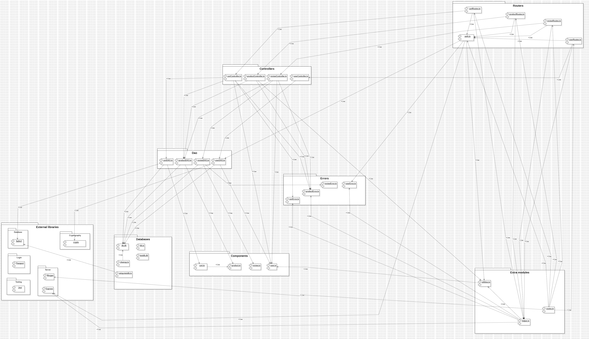
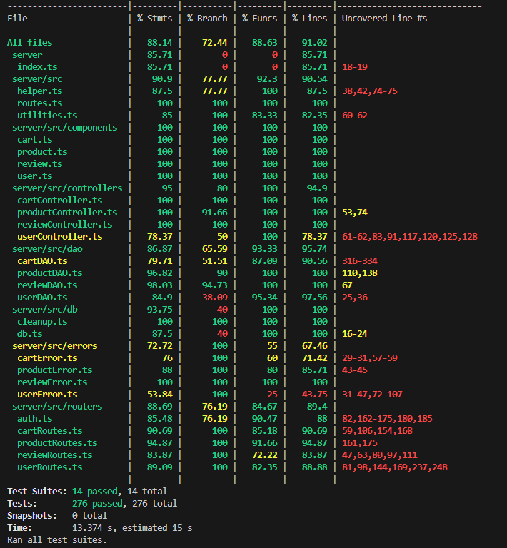

# Test Report

<The goal of this document is to explain how the application was tested, detailing how the test cases were defined and what they cover>

# Contents

- [Test Report](#test-report)
- [Contents](#contents)
- [Dependency graph](#dependency-graph)
- [Integration approach](#integration-approach)
- [Tests](#tests)
- [Coverage](#coverage)
  - [Coverage of FR](#coverage-of-fr)
  - [Coverage white box](#coverage-white-box)

# Dependency graph

# Integration approach

The integration approach that our team adopted is a bottom up approach testing:

- The lowest layer is the data access object DAO which have been tested by the means of unit testing
- The upper layer is the APIs which have been tested using the integration testing technique

Our team opted for an incremental integration strategy because:

- The components of the underlying layer has been tested with unit testing with the goal of obtaining an high coverage. This strategy makes the integration testing of the apis faster because there is no needed to test that the bottom layer functionalities are working properly.

# Tests

Unit Test - controller_tests

| Test case name | Object(s) tested | Test level | Technique used |
| :------------: | :--------------: | :--------: | :------------: |
|Should successfully create a new user and return true| createUser       |unit test   |statement coverage|
|Should throw UserAlreadyExistsError if user to create already exists|createUser|unit test|statement coverage|
|Should successfully return a list of all users|getUsers|   unit test|statement coverage|
|Should successfully return a list of all users with the specified role|getUsersByRole|        unit test|statement coverage|
|Should successfully return a specific user by username|getUserByUsername|unit test|  statement coverage |
|Should throw UnauthorizedUserError if non-admin user tries to retrieve another user's information|getUserByUsername|unit test|statement coverage|
|Should throw UserNotFoundError if user to retrieve is not found|getUserByUsername|unit test|statement coverage|
|Should successfully delete a specific user and return true|deleteUser|unit test|statement coverage|
|Should throw UserNotAdminError if non-admin user tries to delete another user|deleteUser|unit test|statement coverage|
|Should throw UserNotFoundError if user to delete is not found|deleteUser|unit test|statement coverage|
|Should throw UnauthorizedUserError if non-admin user tries to delete another user's information|deleteUser|unit test|statement coverage|
|Should successfully delete all users|deleteAll|unit test|statement coverage|
|Should successfully update a user's information|updateUserInfo|unit test|statement coverage|
|Should throw UserBirthdayError if birthdate is invalid|updateUserInfo|unit test|statement coverage|
|Should throw UserNotAdminError if a non-admin user tries to update another user's information|updateUserInfo|unit test|statement coverage|
|Should throw UserNotFoundError if user to update does not exist|updateUserInfo|unit test|statement coverage|
|Should throw UnauthorizedUserError if admin user tries to update another admin user's information|updateUserInfo|unit test|statement coverage|
|--|--|--|--|
|Should successfully add a product to the user's cart|addToCart|unit test|statement coverage|
|Should throw ProductNotFoundError if product to add does not exist|addToCart|unit test|statement coverage|
|Should throw EmptyProductStockError if product to add has no stock available|addToCart|unit test|statement coverage|
|Should successfully retrieve a cart with items|getCart|unit test|statement coverage|
|Should successfully retrieve an empty cart|getCart|unit test|statement coverage|
|Should successfully checkout a cart|checkoutCart|unit test|statement coverage|
|Should throw CartNotFoundError if cart to checkout does not exist|checkoutCart|unit test|statement coverage|
|Should throw EmptyCartError if cart to checkout is empty|checkoutCart|unit test|statement coverage|
|Should throw EmptyProductStockError if product in cart has no stock available|checkoutCart|unit test|statement coverage|
|Should throw LowProductStockError if product quantity is less than the requested quantity in cart|checkoutCart|unit test|statement coverage|
|Should successfully retrieve a customer's carts|getCustomerCarts|unit test|statement coverage|
|Should successfully remove a product from the cart|removeProductFromCart|unit test|statement coverage|
|Should throw ProductNotFoundError if product to remove does not exist|removeProductFromCart|unit test|statement coverage|
|Should throw CartNotFoundError if cart does not exist|removeProductFromCart|unit test|statement coverage|
|Should throw EmptyCartError if cart is empty|removeProductFromCart|unit test|statement coverage|
|Should throw ProductNotInCartError if product to remove is not in cart|removeProductFromCart|unit test|statement coverage|
|Should successfully clear a cart|clearCart|unit test|statement coverage|
|Should throw CartNotFoundError if cart to clear does not exist|clearCart|unit test|statement coverage|
|Should successfully delete all carts|deleteAllCarts|unit test|statement coverage|
|Should successfully retrieve all carts|getAllCarts|unit test|statement coverage|
|--|--|--|--|
|Should successfully register a new product|registerProducts|unit test|statement coverage|
|Should throw ProductAlreadyExistsError if product to register already exists|registerProducts|unit test|statement coverage|
|Should throw DateError if product registration date is invalid|registerProducts|unit test|statement coverage|
|Should successfully change product quantity|changeProductQuantity|unit test|statement coverage|
|Should throw ProductNotFoundError if product to change quantity does not exist|changeProductQuantity|unit test|statement coverage|
|Should throw DateError if product quantity change date is invalid|changeProductQuantity|unit test|statement coverage|
|Should successfully sell a product and update stock|sellProduct|unit test|statement coverage|
|Should throw ProductNotFoundError if product to sell does not exist|sellProduct|unit test|statement coverage|
|Should throw LowProductStockError if insufficient stock for sale|sellProduct|unit test|statement coverage|
|Should throw DateError if product sale date is invalid|sellProduct|unit test|statement coverage|
|Should successfully retrieve all products|getProducts|unit test|statement coverage|
|Should throw ProductNotFoundError if no products exist|getProducts|unit test|statement coverage|
|Should successfully retrieve available products|getAvailableProducts|unit test|statement coverage|
|Should throw ProductNotFoundError if no available products exist|getAvailableProducts|unit test|statement coverage|
|Should return an empty array if no available products exist|getAvailableProducts|unit test|statement coverage|
|Should successfully delete a product|deleteProduct|unit test|statement coverage|
|Should throw ProductNotFoundError if product to delete does not exist|deleteProduct|unit test|statement coverage|
|Should successfully delete all products|deleteAllProducts|unit test|statement coverage|
|--|--|--|--|
|Should successfully add a review to a product|addReview|unit test|statement coverage|
|Should throw ProductNotFoundError if product to review does not exist|addReview|unit test|statement coverage|
|Should successfully retrieve all reviews for a product|getProductReviews|unit test|statement coverage|
|Should successfully delete a specific review|deleteReview|unit test|statement coverage|
|Should throw ProductNotFoundError if product, for review deletion, does not exist|deleteReview|unit test|statement coverage|
|Should successfully delete all reviews for a specific product|deleteReviewsOfProduct|unit test|statement coverage|
|Should throw ProductNotFoundError if product, for bulk review deletion, does not exist|deleteReviewsOfProduct|unit test|statement coverage|
|Should successfully delete all reviews|DeleteAllReviews|unit test|statement coverage|

Unit Test - dao_tests
| Test case name | Object(s) tested | Test level | Technique used |
| :------------: | :--------------: | :--------: | :------------: |
|Should successfully add a product to an existing cart|addToCart|unit test|statement coverage|
|Should throw ProductNotFoundError if the product to add does not exist|addToCart|unit test|statement coverage|
|Should create and add product to a new cart if no existing cart exists|addToCart|unit test|statement coverage|
|Should throw an error if a database error occurs while adding to cart|addToCart|unit test|statement coverage|
|Should handle edge case: very long customer name while adding to cart|addToCart|unit test|edge case|
|Should successfully retrieve the history of paid carts for a customer|getCustomerCarts|unit test|statement coverage|
|Should throw an error if a database error occurs while fetching carts|getCustomerCarts|unit test|statement coverage|
|Should return an empty array if the customer has no paid carts|getCustomerCarts|unit test|statement coverage|
|Should handle edge case: very long customer name while fetching carts|getCustomerCarts|unit test|edge case|
|Should successfully checkout the current cart|checkoutCart|unit test|statement coverage|
|Should throw an error if a database error occurs while retrieving the cart|checkoutCart|unit test|statement coverage|
|Should throw an error if a database error occurs while updating the cart|checkoutCart|unit test|statement coverage|
|Should handle edge case: no current cart exists when checking out|checkoutCart|unit test|edge case|
|Should handle edge case: very long customer name while checking out|checkoutCart|unit test|edge case|
|Should successfully retrieve the current cart of a customer|getCart|unit test|statement coverage|
|Should return null if no current cart exists|getCart|unit test|statement coverage|
|Should throw an error if a database error occurs while retrieving the cart|getCart|unit test|statement coverage|
|Should throw an error if a database error occurs while retrieving cart products|getCart|unit test|statement coverage|
|Should handle edge case: very long customer name while retrieving cart|getCart|unit test|edge case|
|Should successfully create a new cart for a customer|createCart|unit test|statement coverage|
|Should handle edge case: very long customer name while creating cart|createCart|unit test|edge case|
|Should successfully update the cart total|updateCartTotal|unit test|statement coverage|
|Should throw an error if a database error occurs while fetching products|updateCartTotal|unit test|statement coverage|
|Should throw an error if a database error occurs while updating the total|updateCartTotal|unit test|statement coverage|
|Should decrease product quantity, in cart, only by one if quantity, in cart, is greater than one|removeProductFromCart|unit test|statement coverage|
|Should remove product from cart if quantity, in cart, is one|removeProductFromCart|unit test|statement coverage|
|Should successfully clear all products from the current cart|clearCart|unit test|statement coverage|
|Should successfully delete all carts from the database|deleteAllCarts|unit test|statement coverage|
|--|--|--|--|
|Should successfully register a new product|registerProduct|unit test|statement coverage|
|Should throw an error if a database error occurs during product registration|registerProduct|unit test|statement coverage|
|Should successfully update a product's quantity|updateProductQuantity |unit test|statement coverage|
|Should throw an error if a database error occurs while updating product quantity|updateProductQuantity|unit test|statement coverage|
|Should successfully retrieve all products|getProducts|unit test|statement coverage|
|Should successfully retrieve products filtered by category|getProducts|unit test|statement coverage|
|Should successfully retrieve products filtered by model|getProducts|unit test|statement coverage|
|Should successfully retrieve products filtered by both category and model|getProducts|unit test|statement coverage|
|Should throw an error if a database error occurs while retrieving products|getProducts|unit test|statement coverage|
|Should successfully retrieve a product by model|getProductByModel|unit test|statement coverage|
|Should handle edge case: product model does not exist|getProductByModel|unit test|edge case|
|Should throw an error if a database error occurs while retrieving by model|getProductByModel|unit test|statement coverage|
|Should handle edge case: empty model string is provided|getProductByModel|unit test|edge case|
|Should handle edge case: prevent SQL injection attempts in model input|getProductByModel|unit test|edge case|
|Should successfully delete a product|deleteProduct|unit test|statement coverage|
|Should throw an error if a database error occurs during product deletion|deleteProduct|unit test|statement coverage|
|Should return true even if no rows are affected by deletion|deleteProduct|unit test|statement coverage|
|Should successfully delete all reviews for a specific product|deleteProductReviews|unit test|statement coverage|
|Should successfully delete all products|deleteAllProducts|unit test|statement coverage|
|Should throw an error if a database error occurs while deleting all products|deleteAllProducts|unit test|statement coverage|
|Should successfully delete all products reviews|deleteAllProductReviews|unit test|statement coverage|
|--|--|--|--|
|Should successfully add a new review to a product|addReview|unit test|statement coverage|
|Should throw ExistingReviewError if a review for the product already exists|addReview|unit test|statement coverage|
|Should throw an error if a database error occurs while checking existing reviews|addReview|unit test|statement coverage|
|Should throw an error if a database error occurs while inserting a new review|addReview|unit test|statement coverage|
|Should successfully return all reviews for a product|getProductReviews|unit test|statement coverage|
|Should return null if no reviews are found for the product|getProductReviews|unit test|statement coverage|
|Should throw an error if a database error occurs while retrieving reviews by model|getProductReviews|unit test|statement coverage|
|Should successfully delete a review|deleteReview|unit test|statement coverage|
|Should throw NoReviewProductError if review to delete does not exist|deleteReview|unit test|statement coverage|
|Should throw an error if a database error occurs during review deletion|deleteReview|unit test|statement coverage|
|Should successfully delete all reviews for a specific product|deleteReviewsOfProduct|unit test|statement coverage|
|Should throw an error if a database error occurs during bulk review deletion|deleteReviewsOfProduct|unit test|statement coverage|
|Should successfully delete all reviews|deleteAllReviews|unit test|statement coverage|
|Should throw an error if a database error occurs during deleting all reviews|deleteAllReviews|unit test|statement coverage|
|--|--|--|--|
|Should successfully create a new user|createUser|unit test|statement coverage|
|Should successfully return an array of all users|getUsers|unit test|statement coverage|
|Should successfully return an array of users with the specified role|getUsersByRole|unit test|statement coverage|
|Should successfully return the user with the specified username|getUserByUsername|unit test|statement coverage|
|Should return null if the user does not exist|getUserByUsername|unit test|statement coverage|
|Should successfully update user information and return the updated user|updateUserInfo|unit test|statement coverage|
|Should successfully delete a user when performed by an admin|deleteUser|unit test|statement coverage|
|Should throw an error if a database query fails during user deletion|deleteUser|unit test|statement coverage|
|Should return true if all non-admin users are successfully deleted|deleteAll|unit test|statement coverage|

Unit Test - route_tests
| Test case name | Object(s) tested | Test level | Technique used |
| :------------: | :--------------: | :--------: | :------------: |
|Should return 401 Unauthorized if a non-admin user tries to retrieve all carts|getCarts|unit test|statement coverage|
|Should return 200 OK and the current cart for a logged-in customer|getCarts|unit test|statement coverage|
|Should return 401 Unauthorized if a user is not logged in when attempting to retrieve their current cart|getCarts|unit test|statement coverage|
|Should return 401 Unauthorized if an unauthenticated user tries to add a product to the cart|postCarts|unit test|statement coverage|
|Should return 200 OK when an authenticated customer successfully adds a product to the cart|postCarts|unit test|statement coverage|
|Should return 422 Unprocessable Entity when an authenticated customer tries to add a product, with an non-existing model, to the cart|postCarts|unit test|statement coverage|
|Should return 401 Unauthorized if an unauthenticated user tries to simulate payment|patchCarts|unit test|statement coverage|
|Should return 401 Unauthorized if a non-customer user tries to simulate payment|patchCarts|unit test|statement coverage|
|Should return 200 OK when a customer successfully simulates a payment|patchCarts|unit test|statement coverage|
|Should return 401 Unauthorized if an unauthenticated user tries to retrieve cart history|getCartsHistory|unit test|statement coverage|
|Should return 401 Unauthorized if a non-customer user tries to retrieve cart history|getCartsHistory|unit test|statement coverage|
|Should return 200 OK when an authenticated customer successfully retrieves their cart history|getCartsHistory|unit test|statement coverage|
|Should return 401 Unauthorized if an unauthenticated user tries to remove a product from the cart|deleteCartsProducts/:model|unit test|statement coverage|
|Should return 401 Unauthorized if a non-customer user tries to remove a product from a cart|deleteCartsProducts/:model|unit test|statement coverage|
|Should return 200 OK when an authenticated customer successfully removes a product from the cart|deleteCartsProducts/:model|unit test|statement coverage|
|Should return 401 Unauthorized if an unauthenticated user tries to empty the cart|deleteCartsCurrent|unit test|statement coverage|
|Should return 401 Unauthorized if a non-customer user tries to empty the cart|deleteCartsCurrent|unit test|statement coverage|
|Should return 200 OK when an authenticated customer successfully empties their cart|deleteCartsCurrent|unit test|statement coverage|
|Should return 401 Unauthorized if a non-admin user tries to delete all carts|deleteCarts|unit test|statement coverage|
|Should return 401 Unauthorized if a non-admin user tries to delete all carts|deleteCarts|unit test|statement coverage|
|Should return 200 OK when an admin user successfully deletes all carts|deleteCarts|unit test|statement coverage|
|Should return 401 Unauthorized if an unauthenticated user tries to retrieve all carts|getCarts/all|unit test|statement coverage|
|Should return 401 Unauthorized if a non-admin user tries to retrieve all carts|getCarts/all|unit test|statement coverage|
|Should return 200 OK when an admin user successfully retrieves all carts|getCarts/all|unit test|statement coverage|
|--|--|--|--|
|Should return 200 OK when an admin successfully adds a product|postProducts|unit test|statement coverage|
|Should return 422 Unprocessable Entity if the manager or admin submits an incomplete product registration request|postProducts|unit test|statement coverage|
|Should return 401 Unauthorized if an unauthenticated user tries to add a product|postProducts|unit test|statement coverage|
|Should return 401 Unauthorized if a non-admin/manager user tries to add a product|postProducts|unit test|statement coverage|
|Should return 200 OK and a list of all products when requested by an admin|getProducts|unit test|statement coverage|
|Should return 200 OK and a specific product when requested by an admin|getProducts/available|unit test|statement coverage|
|Should return 401 Unauthorized if an unauthenticated user tries to get a product|getProducts/available|unit test|statement coverage|
|Should return 422 Unprocessable Entity when a manager or admin requests stock information with an invalid product model|getProducts/available|unit test|statement coverage|
|Should return 200 OK when an admin successfully deletes a product|deleteProducts/:model|unit test|statement coverage|
|Should return 401 Unauthorized if a non-admin tries to delete a product|deleteProducts/:model|unit test|statement coverage|
|Should return 200 OK when an admin successfully deletes all products|deleteProducts|unit test|statement coverage|
|Should return 401 Unauthorized if a non-admin tries to delete all products|deleteProducts|unit test|statement coverage|
|Should return 401 Unauthorized if an unauthenticated user tries to delete all products|deleteProducts|unit test|statement coverage|
|Should return 200 OK when an admin successfully increases a product's stock|patchProducts/:model|unit test|statement coverage|
|Should return 401 Unauthorized if a non-admin tries to increase stock|patchProducts/:model|unit test|statement coverage|
|Should return 422 Unprocessable Entity if the manager or admin submits a stock update request without a specified date|patchProducts/:model|unit test|statement coverage|
|Should return 404 Not Found if the product model is invalid|patchProducts/:model|unit test|statement coverage|
|Should return 401 Unauthorized if an unauthenticated user tries to increase stock|patchProducts/:model|unit test|statement coverage|
|Should return 200 OK when an admin successfully sells a product|patchProducts/:model/sell|unit test|statement coverage|
|Should return 401 Unauthorized if a non-admin tries to sell a product|patchProducts/:model/sell|unit test|statement coverage|
|Should return 422 Unprocessable Entity if the manager or admin submits a product sale and stock update request without a specified date.|patchProducts/:model/sell|unit test|statement coverage|
|Should return 401 Unauthorized if an unauthenticated user tries to sell a product|patchProducts/:model/sell|unit test|statement coverage|
|--|--|--|--|
|Should return 200 OK when an authenticated customer successfully adds a review|postReviews/:model|unit test|statement coverage|
|Should return 401 Unauthorized if an unauthenticated user attempts to create a product review|postReviews/:model|unit test|statement coverage|
|Should return 401 Unauthorized when a non-customer attempts to add a product review|postReviews/:model|unit test|statement coverage|
|Should return 422 Unprocessable Entity if a customer submits a product review without a comment|postReviews/:model|unit test|statement coverage|
|Should return 200 OK with all reviews for a product|getReviews/:model|unit test|statement coverage|
|Should return 401 Unauthorized when an unauthenticated user attempts to retrieve product reviews|getReviews/:model|unit test|statement coverage|
|Should return 200 OK when a review is successfully deleted|deleteReviews/:model|unit test|statement coverage|
|Should return 401 Unauthorized when an unauthenticated user attempts to delete a review|deleteReviews/:model|unit test|statement coverage|
|Should return 401 Unauthorized when a non-customer user attempts to delete a review|deleteReviews/:model|unit test|statement coverage|
|Should return 200 OK when all reviews for a product are successfully deleted|deleteReviews/:model/all|unit test|statement coverage|
|Should return 401 Unauthorized when an unauthenticated user attempts to delete all reviews for a product|deleteReviews/:model/all|unit test|statement coverage|
|Should return 401 Unauthorized when a non-admin or non-manager user attempts to delete all reviews for a product|deleteReviews/:model/all|unit test|statement coverage|
|Should return 200 OK when all reviews are successfully deleted|deleteReviews|unit test|statement coverage|
|Should return 401 Unauthorized when an unauthenticated user attempts to delete all reviews|deleteReviews|unit test|statement coverage|
|Should return 401 Unauthorized when a non-admin or non-manager user attempts to delete all reviews|deleteReviews|unit test|statement coverage|
|--|--|--|--|
|Should return 200 OK after successfully creating a user|postUsers|unit test|statement coverage|
|Should return 422 Unprocessable Entity if a customer submits a registration request without a username|postUsers|unit test|statement coverage|
|Should return 200 OK with an array of users|getUsers|unit test|statement coverage|
|Should return 401 Unauthorized when a non-admin user attempts to retrieve user information|getUsers|unit test|statement coverage|
|Should return 401 Unauthorized when an unauthenticated user attempts to retrieve user information|getUsers|unit test|statement coverage|
|Should return 200 OK with an array of users matching the specified role|getUsers/roles/:role|unit test|statement coverage|
|Should return 422 Unprocessable Entity when requesting users with an invalid role|getUsers/roles/:role|unit test|statement coverage|
|Should return 401 Unauthorized when an unauthenticated user attempts to retrieve information of users with a specific role |getUsers/roles/:role|unit test|statement coverage|
|Should return 401 Unauthorized when an non-admin user attempts to retrieve information of users with a specific role|getUsers/roles/:role|unit test|statement coverage|
|Should return 200 OK with the user matching the specified username|getUsers/:username|unit test|statement coverage|
|Should return 401 Unauthorized when an unauthenticated user attempts to retrieve a user by username|getUsers/:username|unit test|statement coverage|
|Should return 200 OK after admin successfully deleting a user|deleteUsers/:username|unit test|statement coverage|
|Should return 401 Unauthorized when an unauthenticated user attempts to delete a user|deleteUsers/:username|unit test|statement coverage|
|Should return 200 OK when an admin user successfully deletes all users|deleteUsers|unit test|statement coverage|
|Should return 401 Unauthorized when a non-admin user attempts to delete all users|deleteUsers|unit test|statement coverage|
|Should return 401 Unauthorized when an unauthenticated user attempts to delete all users|deleteUsers|unit test|statement coverage|
|Should return 200 OK when the personal information of a single user is successfully updated|patchUsers/:username|unit test|statement coverage|
|Should return 422 Unprocessable Entity if a user submits an incomplete user information update request|patchUsers/:username|unit test|statement coverage|
|Should return 401 Unauthorized when an unauthenticated user attempts to update the personal information of a user|patchUsers/:username|unit test|statement coverage|

Integration Test - All Use Case scenario, u.test.ts
| Test case name | Object(s) tested | Test level | Technique used |
| :------------: | :--------------: | :--------: | :------------: |
|SC 1.1: Successful login, return 200|U1: Login|Integration test|partitioning|
|SC 1.2: Wrong password, return 401|U1: Login|Integration test|partitioning|
|SC 1.3: Non-existent user, return 404|U1: Login|Integration test|partitioning|
|SC 1.4: User already logged in, return 401|U1: Login|Integration test|partitioning|
|SC 2.1: Logout, return 200|U2: Logout|Integration test|partitioning|
|SC 2.2: User already logged out, return 401|U2: Logout|Integration test|partitioning|
|SC 3.1: Registration, return 200|U3: Create Account|Integration test|partitioning|
|SC 3.2: Username already in use, return 409|U3: Create Account|Integration test|partitioning|
|SC 3.3: User provides empty parameters, return 422|U3: Create Account|Integration test|partitioning|
|SC 4.1: View the information of one user, return 200|U4: View users|Integration test|partitioning|
|SC 4.2: Ask to view information of a user who does not exist, return 404|U4: View users|Integration test|partitioning|
|SC 4.3: View the information of all users, return 200|U4: View users|Integration test|partitioning|
|SC 4.4: View the information of all users with a specific role (Customer or Manager), return 200|U4: View users|Integration test|partitioning|
|SC 4.5: Ask to view information of users with a role that does not exist, return 422|U4: View users|Integration test|partitioning|
|SC 5.1: Delete one user, return 200|U5: Delete one user|Integration test|partitioning|
|SC 5.2: Try to delete a user that does not exist, return 404|U5: Delete one user|Integration test|partitioning|
|SC 6.1: Register a new product, return 200|U6: Register products|Integration test|partitioning|
|SC 6.2: Try to register a product that already exists, return 409|U6: Register products|Integration test|partitioning|
|SC 6.3: Try to register a product with invalid input parameters, return 422|U6: Register products|Integration test|partitioning|
|SC 6.4: Update the quantity of a product, return 200|U6: Register products|Integration test|partitioning|
|SC 6.5: Try to increase the quantity of a product that does not exist, return 404|U6: Register products|Integration test|partitioning|
|SC 7.1: Sell a product after an in-store purchase, return 200|U7: Sell a product|Integration test|partitioning|
|SC 7.2: Try to sell a product that does not exist, return 404|U7: Sell a product|Integration test|partitioning|
|SC 7.3: Try to sell an unavailable product, return 409|U7: Sell a product|Integration test|partitioning|
|SC 8.1: View information of a single product, return 200|U8: View products|Integration test|partitioning|
|SC 8.2: Try to view information of a product that does not exist, return 404|U8: View products|Integration test|partitioning|
|SC 8.3: View information of all products, return 200|U8: View products|Integration test|partitioning|
|SC 8.4: View information of all products of the same category, return 200|U8: View products|Integration test|partitioning|
|SC 8.5: Try to view information of all products with a category that does not exist, return 422|U8: View products|Integration test|partitioning|
|SC 8.6: View information of all products with the same model, return 200|U8: View products|Integration test|partitioning|
|SC 8.7: View information of all available products, return 200|U8: View products|Integration test|partitioning|
|SC 8.8: View information of all available products of the same category, return 200|U8: View products|Integration test|partitioning|
|SC 8.9: View information of all available products with the same model, return 200|U8: View products|Integration test|partitioning|
|SC 9.1: Delete one product, return 200|U9: Delete one product |Integration test|partitioning|
|SC 9.2: Try to delete a product that does not exist, return 404|U9: Delete one product |Integration test|partitioning|
|SC 10.1: View the current cart (not paid yet), return 200|UC10: Manage carts|Integration test|partitioning|
|SC 10.2: View the history of already paid carts, return 200|UC10: Manage carts|Integration test|partitioning|
|SC 10.3: Add a product to the current cart, return 200|UC10: Manage carts|Integration test|partitioning|
|SC 10.4: Try to add a product that does not exist to the current cart, return 404|UC10: Manage carts|Integration test|partitioning|
|SC 10.5: Try to add a product that is not available to the current cart, return 409|UC10: Manage carts|Integration test|partitioning|
|SC 10.6: Pay for the current cart, return 200|UC10: Manage carts|Integration test|partitioning|
|SC 10.7: Try to pay for an empty cart, return 400 |UC10: Manage carts|Integration test|partitioning|
|SC 10.8: Try to pay for a cart that does not exist, return 404|UC10: Manage carts|Integration test|partitioning|
|SC 10.9: Remove one product instance product from the current cart, return 200|UC10: Manage carts|Integration test|partitioning|
|SC 10.10: Try to remove a product that does not exist from the current cart, return 404|UC10: Manage carts|Integration test|partitioning|
|SC 10.11: Try to remove a product from a cart that does not exist, return 404|UC10: Manage carts|Integration test|partitioning|
|SC 10.12: Try to remove a product that is not in the current cart, return 404 |UC10: Manage carts|Integration test|partitioning|
|SC 11.1: Delete the current cart, return 200|UC11: Delete the current cart|Integration test|partitioning|
|SC 11.2: Try to delete the current cart when there is none, return 404|UC11: Delete the current cart|Integration test|partitioning|
|SC 12.1: Edit user information, return 200|UC12: Edit user information|Integration test|partitioning|
|SC 13.1: Delete all non-Admin users, return 200|UC13: Delete all non-Admin users|Integration test|partitioning|
|SC 14.1: Delete all products, return 200|UC14: Delete all products|Integration test|partitioning|
|SC 15.1: View all carts, return 200|UC15: View all carts|Integration test|partitioning|
|SC 16.1: Delete all carts, return 200|UC16: Delete all carts|Integration test|partitioning|
|SC 17.1: Add a review to a product, return 200|UC17: Manage reviews|Integration test|partitioning|
|SC 17.2: Delete review given to a product, return 200|UC17: Manage reviews|Integration test|partitioning|
|SC 18.1: View the reviews of a product, return 200|UC18: View reviews|Integration test|partitioning|
|SC 19.1: Delete all reviews of one product, return 200|UC19: Delete reviews|Integration test|partitioning|
|SC 19.2: Delete all reviews of all products, return 200|UC19: Delete reviews|Integration test|partitioning|

# Coverage

## Coverage of FR

| Functional Requirement or scenario | Test(s) |
| :--------------------------------: | :-----: |
| FR  1.1                            | Login block |
| FR  1.2                            | Logout block|
| FR  1.3                            | Create Account block |
| FR  2.1, FR  2.2,  FR  2.3          | View users block|
| FR  2.4  |    updateUserInfo block     |
| FR  2.5  |   Delete one user block      |
| FR  2.6  |Delete all non-Admin users block|
| FR  3.1, FR  3.2 |Register products block|
| FR  3.3  |Sell a product block|
| FR  3.4, FR  3.4.1, FR  3.5, FR  3.5.1 |View products block |
| FR  3.7  |Delete one product block|
| FR  3.8  |Delete all products block|
| FR  4.1, FR  4.3  |Manage reviews block|
| FR  4.2  |View reviews block|
| FR  4.4, FR  4.5    |Delete reviews block|
| FR  5.1, FR  5.2, FR  5.3, FR  5.4, FR  5.5      |Manage carts block|
| FR  5.6  |Delete the current cart block |
| FR  5.7  |View all carts block|
| FR  5.8  |Delete all carts block|

## Coverage white box

